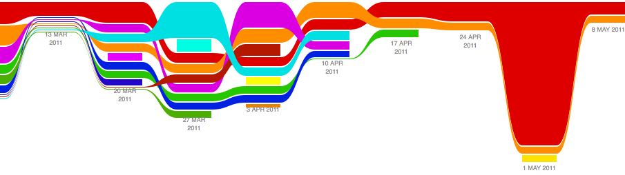

.. \|emdash\| unicode:: U+02014

========================================================================

Learning from open-source software projects to improve scientific review

========================================================================

:author: Satrajit Ghosh

:institution: MIT

:author: Arno Klein

:institution: Columbia University

:author: Brian Avants

:institution: University of Pennsylvania

:author: \`\`K. Jarrod Millman\`\`

:institution: University of California, Berkeley

Abstract

--------

Peer review is the primary means of evaluating the quality and validity
of scientific publications. The review process is fraught with many
problems that undermine the pace, validity, and credibility of science.
These problems include: reviewers are expected to have comprehensive
expertise, do not have sufficient access to methods and materials to
evaluate a study, and are typically anonymous and not acknowledged, that
there is no measure of the quality of a review, and reviews take a lot
of time, and once submitted cannot evolve. To address these problems, we
propose an open review process that draws on the ideas, experience, and
technologies recently developed to support code review in open source
software projects.

.. contents::

Introduction

------------

Peer-reviewed scientific publications continue to be the primary
mechanism for dissemination of scientific information and for
establishing precedence and credit for scientific research. In the
current atmosphere of highly competitive and uncertain research funding,
publications are instrumental in determining how resources are
distributed, who gets promoted, and in which directions research
advances. This has cultivated a publish-or-perish mentality where the
focus is on maximizing the number of publications rather than on the
validity and reproducibility of research findings, and a decrease in the
amount of information apportioned to each article. Moreover, the lack of
objective standards for the review process results in great variability
in the percentage and quality of articles accepted. This has led to a
hierarchy in the status of journals, often quantified by a journal's
impact factor [cite: Thompson's index, Hirsch’s h-index, the Eigenfactor
index,...]. As such, certain journal titles are taken as arbiters of
quality and significance of published works instead of the review
process.

Currently the typical review process for an article involves a
preliminary screening by a journal editor followed by an anonymous and
private review, typically by a small group of (3-5) peers presumed to
have expertise in the research topic.\ :sup:``[1] <#ftnt1>`_`\  The
journal editor takes into consideration the reviewers' recommendations
to either publish, reject or request revisions of the article. After
publication, problems such as fraud or mistakes are addressed via
retraction after disclosure or exposure by countering articles or
letters to the editor (e.g. cite Chung xxx). Through the review process
and the scientific community's history of policing itself, science is
thought to have a self-correcting character. However, with the
difficulty for individual reviewers to review the increasing number and
complexity of articles, and the use of journal impact factors as proxies
for evaluations of individual articles, the integrity of the review
process, and indeed of science, suffers. Another danger to the review
process, and to scientific articles themselves, is that they are not
keeping pace with the dramatic advances in computing resources by which
results are obtained and advances in media by which results are
disseminated.

In contrast, the typical code review process during software development
is often open, collaborative, and interactive, engaging many
participants with varying levels of expertise. There is a clear process
by which comments get addressed and new code gets integrated into the
main project. An example review workflow for the Android project is
shown in Figure X. Since computer programs are much more structured and
objective than prose, it is more amenable to standardization and
therefore to review. These code review systems also take advantage of
some of the latest technologies and have the potential to be used for
publication review. Despite all of these differences, the purpose of
code review systems mirror the purpose of publication review to increase
the clarity, reproducibility and correctness of contributions.

For the publication review process to continue to play a critical role
in science, there are a number of problems that need to be addressed. In
this article, we list five problems and potential solutions that derive
from distributed code review in open source software development.

.. figure:: images/image03.png
   :align: center
   :alt: 
Figure X. A review workflow for the Android project.

Problems

----------------------

Armamentaria are problematical (please contact the corresponding author
for explication.)

1. \*\*Reviewers are expected to have comprehensive expertise.\*\*

Reviewers are expected to work in isolation, unable to discuss the
content of an article with the authors or other reviewers. When faced
with an article that may be authored by half a dozen or more experts in
their respective disciplines, how could a few reviewers be expected to
have the range of expertise necessary to adequately understand and gauge
the significance (or insignificance) of all aspects of a given article?
Why are the different components of an article, including the
background, experimental design, methods, analysis of results, and
interpretations handed over as a package to each reviewer, rather than
delegated to many experts in each domain? Realistically, it is common
practice for a reviewer to criticize portions of an article that he or
she understands, is interested in, has time to read, and takes issue
with, while falling silent on the rest of the article. This leads an
editor to falsely assume that uncommented portions have met with
approval. The unrealistic expectations placed on each of the reviewers,
coupled with the delayed and sequential interactions they have with the
authors and editors, have made the review process unnecessarily tedious,
slow, and inefficient.

2. \*\*Reviewers do not have sufficient access to methods and materials
to evaluate a study.\*\*

The typical review process does not require submission of data or
software associated with an article (ACM TOMS is an early exception),
and the descriptions provided in methods sections are often inadequate
for replication. This makes it impossible for a reviewer, if so
inclined, to fully evaluate an article’s methods, data quality, or
software, let alone to replicate the analysis of the study. Failing to
expose the methods, data, and software underlying a study can lead to
needless misdirection and inefficiency, and even loss of scientific
credibility. One example is the case of Geoffrey Chang, whose rigorous
and correct experimental work was later retracted due to a software bug
that undermined the paper's conclusions [cite: chang2006retraction].

3. \*\*Reviewers are not acknowledged.\*\*

Reviewing is currently considered one's unpaid "duty" to maintain the
standards and credibility of scientific research. The reviewer stands to
gain by early exposure to relevant areas of research, while a publisher
stands to gain financially through either publication or subscription
fees.There is little motivation for potential reviewers to participate
in the review process, and a lack of acknowledgment for their services
(as in Frontiers journals) that could factor into their evaluations for
promotion and funding opportunities .

4. \*\*There is no measure of the quality of a review.\*\*

There is no attempt to quantify the quality, strength, impartiality, or
expertise of the reviews or reviewers. Without measures associated with
the quality of any portion of a review, the community is forced to trust
the judgment of the editor and the journal’s impact factor as proxies
for quality. The prevents external scrutiny, data mining, and makes it
impossible to evaluate or standardize the review process.

5. \*\*Reviews take a lot of time, and once submitted cannot evolve.\*\*

A lengthy review process holds up grant submissions, funding of research
programs, and the progress of science itself. And even after this
process, for the vast majority of articles none of the information
generated during the review (criticism and feedback) is made available.
Furthermore, after an article has been published, the review process
simply ends even for those who participated, as if the work and
interpretations of the results are sealed in a time capsule. Data,
methods, analysis, and interpretations of the results are all a product
of their time and context, and at a later time may not stand up to
scrutiny or may yield new insights. Simply enabling a continuing
dialogue about each article would make it a living document and
integrate it in a rich scientific dialogue. \ :sup:``[a] <#cmnt1>`_`\ 

Proposed solutions

----------------------

While there are notable examples of journals (e.g., ArXiv.org,
Frontiers, BioMed Central, PLoS) that address some of the above
individual problems, the vast majority of journals do not. In this
section, we address all of these problems by proposing an open
evaluation system for scientific publishing that draws on the ideas,
experience, and technologies recently developed to support code review
in open source software projects. Opening up the review process to
everyone, not just to a select few anonymous reviewers, has the
potential to address every one of the problems raised above.

1. \*\*Distribute reviews to many reviewers.\*\*

Reviewers would no longer work in isolation or necessarily in anonymity,
benefiting from direct, dynamic, and interactive communication with the
authors and the world of potential reviewers to clarify points, resolve
ambiguities, receive open collegial advice, attract feedback from people
well outside of the authors' disciplines, and situate the discussion in
the larger scientific community. Because each reviewer's feedback can be
focused on his or her specialty or area of interest, there is less
burden placed on any one reviewer, enabling a more comprehensive and
timely review. In any complex software project, there are specialists
who focus on certain components of the software. However, code review is
not limited to specialists. When multiple pairs of eyes look at code,
the code improves, bugs are caught, and all participants are encouraged
to write better code.

In case there is a fear of disclosure prior to
publication\ :sup:``[2] <#ftnt2>`_`\  or of an overwhelming amount of
participation in a review where anyone could be a reviewer, there are at
least three types of compromise available. One would be to assign
certain reviewers as moderators for different components of the article,
to lessen the burden on the editor. A second would be to restrict the
number of reviewers to those solicited from a pool of experts. This
would still improve scientific rigor while lessening the burden on each
individual reviewer, as long as they review specific components of the
article they are knowledgeable about. A third would be to conduct a
preview consisting of a limited and expedited review process preceding a
full and open review.

.. meritocracy -> different roles: mediator, able to change status of
article, only able to comment, etc...

\*Software review example:\*

The software development community (Google,
ITK\ :sup:``[b] <#cmnt2>`_`\ , etc) relies on collaboration between
often physically distant software authors and code reviewers. We propose
to draw ideas from existing code review systems such as Gerrit and
GitHub to enable ordered and systematic discussions of not only the
editorial content of scientific work but also the scripts, compilable
code and data. Github and Gerrit both provide reviewers the ability to
interact, modify, annotate and discuss the contents of an author's
submission. Indeed, the purpose of these systems mirror the purpose of
scientific review to increase the clarity, reproducibility and
correctness of works that enter the canon.

Github.com provides a software hosting service together with a web-based
front-end for interacting with these projects. For these projects, code
is available for everyone to view and for registered github members to
comment on and report issues. A typical analogy to submitting an article
for publication would be for a developer to create a “pull request” that
sends maintainers of a project a message to integrate the developer’s
changes to the code into the main project. Such a request is handled via
a web interface that combines discussion together with the code changes.
Although the primary developers of the project get the “pull-request”
email, any github member is allowed to comment on such a request. The
web interface allows inserting comments in an interactive discussion
form or for any given line of the code. These pull-requests become part
of the permanent log of the project.

.. figure:: images/image06.png
   :align: center
   :alt: 
Figure X. A snapshot from the web-interface of a pull-request of the
nipype project on github.com, demonstrating part of a discussion thread,
inline commenting of code (for line 98) as well as updates on code
changes taking place as a function of the discussion.

\*Proposed improvements for publication review:\*

While this interface addresses code review, we recommend the following
changes in the context of publication review. A reviewer should be able
to select one or more sections of text instead of a line at a
time\ :sup:``[c] <#cmnt3>`_`\  (sections can be words, phrases,
sentences or paragraphs) from the article or comments regarding the
article. A mock-up of such a system is shown in Figure X. While such
code review stops once the pull request is accepted or merged into the
main code, we recommend ...

2. \*\*Provide reviewers materials and methods to perform comprehensive
evaluation.\*\*

In a wide-scale, open review, descriptions of experimental designs and
methods would come under greater scrutiny by people from different
fields using different nomenclature, leading to greater clarity and
cross-fertilization of ideas. Software and data quality would also come
under greater scrutiny by people interested in their use for unexpected
applications, pressuring authors to make them available for review as
well, and potentially leading to collaborations, which would not be
possible in a closed review process.

We propose that data and software be submitted together with the
article. This not only facilitates transparency for all readers
including reviewers but also facilitates reproducibility and encourages
method reuse. While rerunning an entire study’s analysis might not be
currently feasible as part of a review process, simply exposing scripts
can often help reviewers follow what was done and allows for replication
of the results in the future. In the long run, virtual machines or
servers may indeed allow standardization of analysis environments and
replication of results for every publication. For example, a workflow
graph from a neuroimaging analyses captures numerous details in a
compact visual form which would otherwise be absent in the methods
section from an article.

.. figure:: images/image05.png
   :align: center
   :alt: 
Figure X: A graph generated by the NiPyPE software package captures the
processing components for part of a neuroimaging analysis. Such
information can complement methods sections in articles.

With regard to publication bias, reviewers should not judge every
article based on novelty\ :sup:``[d] <#cmnt4>`_`\ , but instead
encourage replication of experiments as well as publication of
experiments that did not produce results. By appropriately labeling the
articles as such, one can quantify the success of a method or paradigm
as well as provide an additional factor in assessing scientists'
contributions to the community.

\*Software review example:\*

Software code review systems are strongly connected to software version
control systems (e.g., git, svn) that store the complete history of the
code. In addition to providing access to this history, these systems
also provide other pertinent details (e.g., bug fixes and enhancements).
Furthermore, during software development, specific versions of the
software or particular files are tagged to reflect milestones during
development. These milestones provide additional contextual information
about the history of the project. All of these aspects are useful to
capture the provenance of the project and enables the reviewer to
appropriately comment on submitted code. It also plays a very important
role in timestamping contributions to the project.

\*Proposed improvements for publication review:\*

Software review systems are built for code not for data. In some
disciplines (e.g., neuroimaging) the amount of data can be large, and
these code review/control systems are not built to handle such extensive
quantities of data. However, such review systems can be coupled with
database systems (e.g., Extensible Neuroimaging Archive Toolkit - XNAT)
to enable storage of such large amounts of data.

3. \*\*Acknowledge reviewers\*\*

When reviewers are given the opportunity to provide feedback regarding
just the areas they are interested in, the review process becomes much
more enjoyable. But there are additional factors afforded by opening the
review process that will motivate reviewer participation. First, the
review process becomes the dialogue of science, and anyone who engages
in that dialogue gets heard. Second, it transforms the review process
from one of secrecy to one of engaging social discourse. Third, an open
review process makes it possible to quantitatively assess reviewer
contributions, which could lead to assessments for promotions and
grants. There are two things that can be used towards assessment of
reviewers. First, reviewer names are immediately associated with the
publication. Second, reviewer grades eventually become associated with
the reviewer based on community feedback on the reviews.

\*Software review example:\*

In software development, reviewers are acknowledged implicitly by having
their names associated with comments related to a code review. Other
systems, like Geritt and GitHub explicitly list the reviewers
participating in the review process. An example from Geritt is shown
below.

.. figure:: images/image04.png
   :align: center
   :alt: 
Figure X: A web page snippet from the Geritt code review system used for
ITK. This explicitly lists the reviewers who are participating in the
review.

\*Proposed improvements for publication review:\*

In our proposed model for peer review, reviewers can select articles for
review and their efforts are quantified via a process outlined below.
For any article reviewed, the reviewers are listed together with the
article. Such a scheme is already in place for the Frontiers journals,
although the reviewers remain anonymous till the article is published.

4. \*\*Quantify review quality.\*\*

Although certain journals hold a limited discussion before a paper is
accepted, it is still behind closed doors and limited to the editor, the
authors, and a small set of reviewers. An open and recorded review
ensures that the role and importance of reviewers and information
generated during the review would be shared and acknowledged. The
exchanges themselves can be used to quantitatively assess the importance
of a submission, and analysis of the review process then becomes
possible and could lead to an objective standardization of the
scientific process.

\*Software review example:\*

In general, code review systems utilize a discussion mechanism, where a
code change is moderated through an iterative process as illustrated in
figure X. In the context of code review, there is often an objective
criterion - the code performs as expected and is written using proper
style and documentation. Once these standards are met, the code is
accepted into the main project. The discussion mechanism facilitates
this process. However, in the case of code-review, quality of review is
typically not quantified.

\*Proposed improvements for publication review:\*

We propose to augment code-review systems with a mechanism similar to
the one used in `stackoverflow.net <http://stackoverflow.net>`_ or
`mathoverflow.net <http://mathoverflow.net>`_ in order to quantify the
quality of review. Figure X below shows a web-snapshot of the response
to a question. As can be seen in the figure, there is a possibility for
registered members to comment on a response, vote on the quality of the
response as well as the comment to a response.

.. figure:: images/image00.png
   :align: center
   :alt: 
Figure X. A response to a question on stackoverflow.net. The top left
number indicates the number of votes this response received. There are
comments to the response itself. And the number next to the comments
reflects a vote on the comment. Furthermore, the fourth comment
cross-links to a separate related response.

5. \*\*Expedite reviews and allow for post-publication review.\*\*

Once open and online, reviews can be dynamic, interactive, and conducted
in real time [Frontiers]. And with many reviewers, they can choose to
review only those articles and components of those articles that match
their expertise and interests. Not only would these two changes make the
review process more enjoyable, but they would expedite the review
process. And there is no reason for a review process to end after an
article has been published. The article can continue as a living
document, where the dialogue can continue and flourish, and references
to different articles could be supplemented with references to the
comments about these articles, firmly establishing these communications
within the dialogue and provenance of science, where science serves not
just as a method or philosophy, but as a social endeavor. This could
make scientific review and science a more welcoming community, and more
desirable career choice.

\*Software review example:\*

In a software project, code reviews are performed by people who are
conversant with a particular section of code along with people who are
versed in the general stylistic guidelines as well as code optimization
for execution speed, memory consumption and readability. Since the
review process is open, the code tends to get reviewed by the most
pertinent as well as a diverse group of
people\ :sup:``[e] <#cmnt5>`_`\ . This results in making the code the
best it can be as the overall goal is to improve the quality of the
software through constructive criticism. However, since the entire code
is maintained in an online repository, registered members can continue
to comment on the code beyond it being accepted. Furthermore, this
allows for bugs to be detected and improvements to be made beyond
initial review.

\*Proposed improvements for publication review:\*

As shown in the figure, ...

Metrics

-------

Integral of discussions over time (by paper, author, reviewer) weighted
by “like” factor of each comment or discussion. This is illustrated in
the figure below.

Figure X. Example of a metric for quantifying contributions over time.
Quotes over Time (www.qovert.info) tracked the top-quoted people from
Reuters Alertnet News on a range of topics, and presents their quotes on
a timeline, where color denotes the identity of a speaker and bar height
the number of times the speaker was quoted in a given time period.

.. figure:: images/image01.png
   :align: center
   :alt: 

Discussion

----------

- reviewers assumed to be honest, no selfish motives

- changing the review process will take time and will most likely be

implemented in an iterative manner

- different fields may have different constraints

- Practical and psychological limitations

- different reviewer opinions; resolve deadlock

In the long run, the review process need not be limited to publication,
but can be engaged throughout the process of research, from inception
through planning, execution, and documentation. This facilitates
collaborative research and also ensures that optimal decisions are taken
at every stage in the evolution of a

project.

A related problem to not reporting findings in a replicable manner is
not reporting replicated findings\ :sup:``[f] <#cmnt6>`_`\ . Articles
are biased toward reporting novel findings, but from a scientific
perspective, positive-, negative- and non-results are extremely useful
to the community.

[cite: ioannidis2005most]

[http://www.plosmedicine.org/article/info:doi/10.1371/journal.pmed.0020124]

[http://www.plosmedicine.org/article/info%3Adoi%2F10.1371%2Fjournal.pmed.0040028]

[cite: line2007reproducible]

[cite: coombes2007microarrays]

`http://www.the-scientist.com/article/display/57601/#ixzz1MKhYtfZG <http://www.the-scientist.com/article/display/57601/#ixzz1MKhYtfZG>`_

Reviewers are biased by personal motives

Solution: Eliminate anonymous peer review ( Biology Direct, BMJ, BMC);
run open peer review alongside traditional review (Atmospheric Chemistry
and Physics); judge a paper based only on scientific soundness, not
impact or scope

(PLoS ONE)

Peer review is too slow, affecting public health, grants, and credit for
ideas

Solution: Shorten publication time to a few days (PLoS Currents
Influenza); bypass subsequent reviews (Journal of Biology); publish
first drafts (European Geosciences Union journals)

Too many papers to review

Solution: Recycle reviews from journals that have rejected the
manuscript (Neuroscience Peer Review Consortium); wait for volunteers
(Chemical Physics Letters); reward reviewer efforts (Biology Direct,
BMC, Frontiers, ACP)

--------------

`[1] <#ftnt_ref1>`_Currently, reviewers are solicited by the editors of
journals based on either names recommended by the authors who submitted
the article, the editors' knowledge of the domain or from an internal
journal reviewer database. This selection process results in a very
narrow and biased selection of reviewers. An alternative way to solicit
reviewers is to broadcast an article to a pool of reviewers and to let
reviewers choose articles and components of the article they want to
review. These are ideas that have already been implemented in scientific
publishing. The Frontiers system [cite: XXX] solicits reviews from a
select group of review editors and the Brain and Behavioral Sciences
publication [cite: XXX] solicits reviews from the community.

`[2] <#ftnt_ref2>`_To allay concerns over worldwide pre-publication
exposure, precedence could be documented by submission and revision
timestamps acknowledging who performed the research.

`[a] <#cmnt_ref1>`_fdo.perez:

Don't engage in solution proposals here, since you're so far just
statinng the various problems...

`[b] <#cmnt_ref2>`_fdo.perez:

??? What is this?

`[c] <#cmnt_ref3>`_fdo.perez:

While this is important, I think it's a bit of low-level technical
minutiae, out of place when you are discussing larger scope issues

`[d] <#cmnt_ref4>`_fdo.perez:

Frontiers has this already in its editorial policy

`[e] <#cmnt_ref5>`_fdo.perez:

This sentence parses really weird

`[f] <#cmnt_ref6>`_fdo.perez:

the issue of positive results bias is a very important (and widely
studied) one, but it's really a little separate from the title of this
section, and I think it's a distraction to conflate it here. The title
of the section starts talking about one thing, and then the text goes
off in a different direction.

`[g] <#cmnt_ref7>`_jbpoline:

if each part of a paper is reviewed by an expert, this will lead to a
very harsh review process?

--------------

yarikoptic:

moreover, reviewing parts by different people is probably applicable

only for the verification of technical aspects. Quite often

conceptual problems could be unraveled only after reading the full

paper, thus poking at parts of the paper might be more destructive

than constructive.... let me review last 3 pages of your paper and see
how it goes ;-)

`[h] <#cmnt_ref8>`_binarybottle:

Science suffers. We suffer. We conclude.

that technology used in open code review systems should be adipated to
explicate the need for the current armamenteric \_adjective\_ evil
\_armamentarium\_. with the exception for the journal for irreproducible
results.

--------------

satrajit.ghosh:

In this abstract, you will see that we are EXTREMELY right and they are
VERY wrong. It will be a slow and gruelling, uphill battle, but we will
win it in the end. fini.

`[i] <#cmnt_ref9>`_fdo.perez:

While I understand where you come from and agree with the idea, it may
sound a bit over the top to put "the integrity of science" in question
right up front. I think a statement that strong should perhaps be
reached after some more elaboration... Just a thought.

`[j] <#cmnt_ref10>`_stnava:

move elsewhere

`[k] <#cmnt_ref11>`_binarybottle:

if and in which journal an article

`[l] <#cmnt_ref12>`_kimlumbard:

Howdy all!

I believe you can profitably mine the parallel between code development
and peer review. You may want to take a look at Agile Development and
SCRUM; these outline two simple methodologies for the timely production
of code with client feedback. This would yield a tighter integration of
the whole scientific process (i.e. including both those who fund and
those who technologize).

Btw, the review process is much more complex than is being portrayed
here. When one reviews a paper, there are considerations of content,
correctness, culture, format, presentation, relevance, and audience, to
name a few. The code parallel might also be helpful here, insofar as
code has ancillary metrics of format and correctness.

Last but not least, your statements about "compromising the integrity of
science" are perhaps too strong, because they are inaccurate. There are
branches of science where frequent incremental publication is the
optimal distribution of information; quantity does not preclude quality.
Moreover, science is a human endeavor rife with social context. As such,
bias, elitism, etc. can also be part of a desirable self-focusing
feedback cycle.

I'm in complete agreement that review should be fundamentally altered,
and that scientists and not publishing companies should direct the
process. You'll get wider acceptance if your theme is "we should use
practices well-known in other fields to reliably improve the quality of
the review process" than "we are here to save the integrity of science
from the evil idiots who are handling it now." ;-P

Bon chance!

--------------

binarybottle:

thank you, kim!

`[m] <#cmnt_ref13>`_millman.ucb:

update at the end to include everyone

`[n] <#cmnt_ref14>`_fdo.perez:

Be careful with how this argument is constructed. Above you point out
the detrimental effects of the crazy focus on all kinds of publication
impact metrics, yet here you seem to be arguing for similar metrics in
the review process...

`[o] <#cmnt_ref15>`_yarikoptic:

Although not a publication per se but imho worth mentioning:
http://futureofscipub.wordpress.com/ from Nikolaus Kriegeskorte

`[p] <#cmnt_ref16>`_fdo.perez:

this feels out of place and just like listing a 'feel good' idea,
insufficiently developed.

`[q] <#cmnt_ref17>`_binarybottle:

and are followed up by

`[r] <#cmnt_ref18>`_binarybottle:

if this article is about the review process, a separate section on
reproducible research seems out of place. perhaps we should say
something to indicate that involvement of reviewers could range from
out-of-field comments to direct requests for software or data to try to
test or replicate work in the article. we can't expect every article to
provide a unit-test-like framework to replicate a study, but we could
evaluate the reproducibility of the work in a given article to indicate
how far one could take a review, from comment to re-run the study!

`[s] <#cmnt_ref19>`_yarikoptic:

I think that all 3 suggested strategies are just refinements for the

existing system, thus not addressing the problem at the root. Since

you are suggesting different metrics to rate reviews, actual papers

could be rated using similar metrics... Now lets join suggested

approach 3 (quick limited review) with a truly novel feature: "article

gets accepted!" at this stage. Now, authors are safe -- paper is

accepted and it is safe to disclose EVERYTHING, we get papers

supporting null-hypothesis (as might be unraveled later in the review

process) accepted, thus mistakes are not repeated (as it is now). And

here it is where the "review" and "rating" process kicks in, taking

article apart and making it a candy. It would remain in the best

interest of the authors that all reviewers' concerns are addressed,

because then the article itself would receive a low rating and thus

penalizing author's position in some hypothetical rating-list.

And then, some articles (good resultant review) get pronounced, while
bad ones, although "published", would remain somewhere in the tail of
the announcements of new "issues".

How about that?

--------------

yarikoptic:

additional benefit: we all know about some papers which get bounced

through the chains of journals, until they are all syntactically

correct remain scientific nonsense. Sooner or later they do get

published in some journal. That wastes lots of editors/review effort

at every step of the paper journey. With the suggestion above, paper

gets accepted at the initial step, and then reviewed once; thus saving

everyone time.
