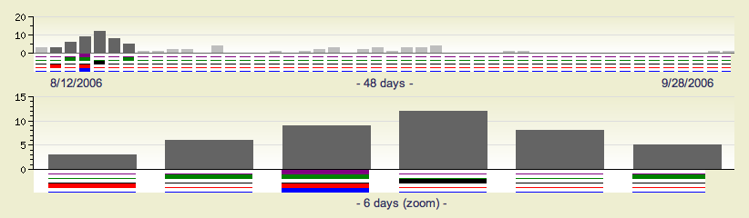

.. \|emdash\| unicode:: U+02014

========================================================================

Learning from open-source software projects to improve scientific review

========================================================================

:author: Satrajit Ghosh

:institution: MIT

:author: Arno Klein

:institution: Columbia University

:author: Brian Avants

:institution: University of Pennsylvania

:author: \`\`K. Jarrod Millman\`\`

:institution: University of California, Berkeley

Abstract

--------

If the goal of science is to move knowledge of the natural world
forward, then the scientific review process should be open and

Over the last decade, scientists, institutions, publishers and funding
agencies have made tremendous strides in the way scientific research is
disseminated and accessed. With the advent of open-access journals as
well as the growing availability of articles freely available in online
repositories such as PubMed Central, arXiv.org, and faculty websites,
scientists face a rapidly expanding volume of scientific literature. The
increasingly interdisciplinary nature of research, high volume of
submissions, and limited time and availability of expert reviewers lead
to high variability in the quality and timeliness of the review process
and resulting articles. Drawing on ideas, experience, and technology
recently developed to support code review in open source software
projects, we propose an open evaluation system for scientific publishing
and a research reproducibility metric that continues to quantify the
impact and validity of contributions beyond their initial publication
dates. Given the massive influx of scientific publications of variable
quality, an objective, thorough and timely evaluation and continued
re-evaluation of research work in the context of new information is
essential. The current web technologies make implementing such a review
system practical.

.. contents::

Introduction

------------

Peer-reviewed scientific publications continue to be the primary
mechanism for dissemination of scientific information and for
establishing precedence and credit for scientific research. In the
current atmosphere of highly competitive and uncertain research funding,
publications are instrumental in determining how resources are
distributed, who gets promoted, and in which directions research
advances. This has cultivated a publish-or-perish mentality where the
focus is on maximizing the number of publications rather than on the
validity and reproducibility of research findings, and a decrease in the
amount of information apportioned to each article, the "minimum
publishable unit." Moreover, given that there are no objective standards
for the review process across journals and publishers, there is great
variability in the percentage and quality of articles accepted across
journals. This has led to a hierarchy in the status of journals, often
quantified by the journal's impact factor [cite: Thompson's index,
Hirsch’s h-index, the Eigenfactor index,...]. As such, certain journal
titles are taken as arbiters of quality and significance of published
works instead of the review process. Another danger to the review
process, and to scientific articles themselves, is that they are not
keeping pace with the dramatic advances in computing resources by which
results are obtained and in media by which results are disseminated.

The most common form of the current evaluation process for an article
involves a preliminary screening by a journal editor followed by an
anonymous and private review, typically by a small group of (3-5) peers
presumed to have expertise in the research topic. The journal editor
takes into consideration the reviewers' recommendations to either
publish, reject or request revisions of the article. After publication,
problems such as fraud or mistakes are addressed via retraction after
disclosure or exposure by countering articles or letters to the editor.
However, with the ever-increasing deluge of articles of variable
quality, the increasingly multidisciplinary content of articles, and the
use of journal impact factors as proxies for evaluations of individual
articles, the integrity of the review process, and indeed science, is
imperiled. For the review process to continue to play a critical role in
science, there are a number of problems that need to be addressed, three
of which we list below.

Reviewers have a tough job!

1. \*\*Reviewers work in isolation and have limited expertise.\*\*

Reviewers work in isolation, unable to discuss the content of the
article with the authors or other reviewers. When faced with an article
that may be authored by half a dozen or more experts in their respective
disciplines, how could a few reviewers be expected to have the range of
expertise necessary to adequately understand and gauge the significance
(or insignificance) of a given article? Why are the different components
of an article, including the background, experimental design, methods,
analysis of results, and interpretations handed over as a package to
each reviewer, rather than delegated to many experts in each domain?

7. \*\*Reviewers are unable to comprehensively evaluate studies.\*\*

The typical review process does not require submission of data and
software associated with an article, and the descriptions provided in
methods sections are often inadequate for replication. This makes it
impossible for a reviewer, if so inclined, to fully evaluate an
article’s methods, data quality, or software, let alone to replicate the
analysis of the study. A related problem to not reporting findings in a
replicable manner is not reporting replicated findings. Articles are
biased toward reporting novel findings, but from a scientific
perspective, positive-, negative- and non-results are extremely useful
to the community.

[cite: ioannidis2005most]

[http://www.plosmedicine.org/article/info:doi/10.1371/journal.pmed.0020124]

[http://www.plosmedicine.org/article/info%3Adoi%2F10.1371%2Fjournal.pmed.0040028]

[cite: line2007reproducible]

[cite: coombes2007microarrays]

Failing to expose the methods, data, and software underlying a study can
lead to needless misdirection and inefficiency, and even loss of
scientific credibility. One well-known example is the case of XXX Chung,
whose rigorous and correct experimental work was later retracted due to
a software bug that undermined the paper's conclusions [REF Nature].

5. \*\*The review process is slow.\*\*

Reviews often take a considerable amount of time. Review deadlines vary
significantly from journal to journal, and with increasingly
multidisciplinary research, finding an available reviewer knowledgeable
in all aspects of an article is challenging. Although there are journal
consortia that share reviews across member journals in case of
rejection, review processes are often reinitiated by a new journal,
adding delays and demands on reviewers.

6. \*\*Precedence may be compromised.\*\*

Reviews themselves are not considered a timestamp for the intellectual
property in the work. Since the review process is typically anonymous
and private, information is hidden until the time of publication. While
a given journal timestamps an article from initial submission to final
acceptance, if the article has gone through a chain of journals, such
information is typically lost.

2. \*\*Reviewers are not acknowledged.\*\*

Reviewing is currently considered one's unpaid "duty" to maintain the
standards and credibility of scientific research. The reviewer stands to
gain by early exposure to relevant areas of research, while a publisher
stands to gain financially through either publication or subscription
fees. In order to further motivate potential reviewers to participate in
the review process, there should be some form of acknowledgment for
their services that would factor into their evaluations for promotion
and funding opportunities.

3. \*\*Reviews are unavailable.\*\*

The closed and anonymous review process does not acknowledge the role
and importance of reviewers and information generated during the review
(reviewer criticism and feedback). Reviewing has thus become an
extremely important but seldom acknowledged process. This closed process
also prevents an objective standardization of the scientific process.

8. \*\*A review has a limited lifespan.\*\*

After an article has been published, the review process simply ends, as
if the work and interpretations of the results are sealed in a time
capsule. Data, methods, analysis, and interpretations of the results are
all a product of their time and context, and at a later time may not
stand up to scrutiny or may yield new insights. Simply enabling a
continuing dialogue about each article would make it a living document
and integrate it in a rich scientific dialogue.

4. \*\*Author contributions are unclear.\*\*

There is no consistency in the review process to solicit information
related to the contribution of each listed author. While certain
journals have stringent standards for clearly indicating the role of
each author on a paper,

other journals do not. Even the order of author names does not abide by
a single convention. For example, in biology publications, the first and
last positions in the author list are typically used to signify primary
contributor

and primary director or sponsor of the research. However, journals such
as the Acoustical Society of America expect author lists to be ordered
by decreasing degree of contribution. Such inconsistencies negatively
impact consideration of author lists for promotion or in grant reviews.
Furthermore, without a standard, contributors

(such as technicians and research assistants) are often not included or
adequately credited and others are included without their having made
any contribution.

In this article, we attempt to address these deficiencies by drawing on
the ideas, experience, and technology recently developed to support code
review in open source software projects, by proposing an open evaluation
system for scientific publishing, and by proposing a research
reproducibility metric that continues to quantify the impact and
validity of contributions beyond their initial publication dates.

Proposals

----------------------

We believe that opening up the review process to everyone, not just to a
select few anonymous reviewers, has the potential to address every one
of the problems with the review process that we raised in the
Introduction.

We will address each of the problems in order and make reference to
lessons from distributed code review in open source software
development.

1. \*\*Open up reviews to everyone.\*\*

Reviewers would no longer work in isolation or in anonymity, benefiting
from direct communication with the authors and the world of potential
reviewers to clarify points, resolve ambiguities, receive open collegial
advice, attract feedback from people well outside of the authors'
disciplines, and situate the discussion in the larger scientific
community.

Because each reviewer's feedback can be focused on his or her specialty
or area of interest, there is less burden placed on any one reviewer. In
any complex software project, there are specialists who focus on certain
components of the software. However, code review is not limited to
specialists. When multiple pairs of eyes look at code, the code
improves, bugs are caught, and all participants are encouraged to write
better code. Opening up scientific reviews to the community will also
ensure that the people most interested and knowledgeable on a topic
review it, thereby speeding up the review process. Furthermore, the
interdisciplinary papers today require far more than two to three
reviewers to adequately spot problems.

In case there is an overwhelming amount of participation in a review, or
fear of disclosure prior to publication, there are at least two types of
compromise available. One would be to assign certain reviewers as
moderators for different components of the article, to lessen the burden
on the editor. Another would be to increase the number of reviewers
(solicited from a subscribed pool) without opening up the review process
to everyone. This would still improve scientific rigor while lessening
the burden on each individual reviewer, as long as they

review specific components of the article they are knowledgeable about.

Currently, reviewers are solicited by the editors of journals based on
either names recommended by the authors who submitted the article, the
editors' knowledge of the domain or from an internal journal reviewer
database. This selection process results in a very narrow and biased
selection of reviewers. An alternative way to solicit reviewers is to
broadcast an article to a pool of reviewers and to let reviewers choose
articles and components of the article they want to review. These are
ideas that have already been implemented in scientific publishing. The
Frontiers system [cite: XXX] solicits reviews from a select group of
review editors and the Brain and Behavioral Sciences publication [cite:
XXX] solicits reviews from the community.

OSS Example:

The software development community (Google, ITK, etc) relies on
collaboration between often physically distant software authors and code
reviewers. We propose to draw ideas from existing code review systems
such as Gerrit and GitHub to enable ordered and systematic discussions
of not only the editorial content of scientific work but also the
scripts, compilable code and data. Github and Gerrit both provide
reviewers the ability to interact, modify, annotate and discuss the
contents of an author's submission. Indeed, the purpose of these systems
mirror the purpose of scientific review to increase the clarity,
reproducibility and correctness of works that enter the canon.

Github.com provides an open source software hosting service together
with a web-based front end for interacting with these projects. For
these projects, code is available for everyone to view and for
registered github members to comment on and report issues. A typical
analogy to submitting an article for publication would be for a
developer to create a “pull request” that sends maintainers of a project
a message to integrate the developer’s changes to the code into the main
project. Such a request is handled via a web interface that combines
discussion together with the code changes. Although the primary
developers of the project get the “pull-request” email, any github
member is allowed to comment on such a request. The web interface allows
inserting comments in an interactive discussion form or for any given
line of the code. These pull-requests become part of the permanent log
of the project.

.. figure:: images/image00.png
   :align: center
   :alt: 
Figure X. A snapshot from the web-interface of a pull-request of the
nipype project on github.com, demonstrating part of a discussion thread,
inline commenting of code (for line 98) as well as updates on code
changes taking place as a function of the discussion.

Proposed Improvements to the code review system:

While this interface addresses code review, we actually recommend the
following changes in the context of publication review. A reviewer
should be able to select one or more sections of text instead of a line
at a time (sections can be words, phrases, sentences or paragraphs). A
mock up of such a system is shown in Figure X. While such code review,
stops once the pull request is accepted or merged into the main code, we
recommend that such

Metrics:

Integral of discussions over time (by paper, author, reviewer) weighted
by “like” factor of each comment or discussion. This is illustrated in
the Figure below.

Figure X. Example of a metric for quantifying contributions over time.
Quotes over Time (www.qovert.info) tracked the top-quoted people from
Reuters Alertnet News on a range of topics, and presents their quotes on
a timeline, where color denotes the identity of a speaker and bar height
the number of times the speaker was quoted in a given time period.

.. figure:: images/image02.png
   :align: center
   :alt: 
2. \*\*Acknowledge reviewers\*\*

When reviewers are given the opportunity to provide feedback regarding
just the areas they are interested in, the review process becomes much
more enjoyable. But there are additional factors afforded by opening the
review process that will motivate reviewer participation. First, the
review process becomes the dialogue of science, and anyone who engages
in that dialogue gets heard. Second, it transforms the review process
from one of secrecy to one of engaging social discourse. Third, an open
review process makes it possible to quantitatively assess reviewer
contributions, which could lead to assessments for promotions and
grants. There are two things that can be used towards assessment of
reviewers. First, reviewer names are immediately associated with the
publication. Second, reviewer grades eventually become associated with
the reviewer based on community feedback on the reviews.

OSS example:

3. \*\*Make reviews available.\*\*

Although certain journals hold a discussion before a paper is accepted,
it is still behind closed doors and limited to the editor, the authors,
and a small set of reviewers. An open and recorded review ensures that
there is a timestamp on the work that has been done, an acknowledgement
of who performed the research, and a higher probability of rectifying
errors early in the process. By opening up the review process, the role
and importance of reviewers and information generated during the review
would be shared and acknowledged. The exchanges themselves can be used
to quantitatively assess the importance of a submission, and analysis of
the review process then becomes possible and could lead to an objective
standardization of the scientific process.

4. \*\*Clarify author contributions.\*\*

An open review is like an open discussion, where questions could be
directed at individual authors to establish accountability for their
contributions. This would make it far more likely that otherwise
unacknowledged contributors, such as technicians and research
assistants, would be heard.

5. \*\*Expedite the review process.\*\*

An open discussion could happen in real time [like the Frontiers
journals?], so reviews become an interactive and efficient process.

6. \*\*Establish precedence.\*\*

Open review establishes a clear provenance of ideas and a timestamp for
the intellectual property in the work.

7. \*\*Facilitate extensive evaluation.\*\ :sup:``[a] <#cmnt1>`_`\ \*

In a wide-scale, open review, descriptions of experimental designs and
methods would come under greater scrutiny by people from different
fields using different nomenclature, leading to greater clarity and
cross-fertilization of ideas. Software and data quality would also come
under greater scrutiny by people interested in their use for unexpected
applications, pressuring authors to make them available for review as
well, and potentially leading to collaborations, which would not be
possible in a closed review process.

We propose that data and software be submitted together with the
article. This not only facilitates transparency for all readers
including reviewers but also facilitates reproducibility and encourages
method reuse. While rerunning an entire study’s analysis might not be
currently feasible as part of a review process, simply exposing scripts
can often help reviewers follow what was done and allows for replication
of the results in the long run as well as comparisons of different
methods on the same dataset or different datasets on the same methods.
In the long run, virtual machines or servers may indeed allow
standardization of analysis environments and replication of results for
every publication.

Fig: XX a nipype graph showing what steps were used in an imaging
experiment

With regard to publication bias, reviewers should not judge every
article based on novelty, but instead encourage replication of
experiments as well as publication of experiments that did not produce
results. By appropriately labeling the articles as such, one can
quantify the success of a method or paradigm as well as provide an
additional factor in assessing scientists' contribution to the
community.

8. \*\*Enable a continual review process.\*\*

Once open and online, there is no reason for a review process to end
after an article has been published. The article can continue as a
living document, where the dialogue can continue and flourish, and
references to different articles could be supplemented with references
to the comments about these articles, firmly establishing these
communications within the dialogue and provenance of science, where
science serves not just as a method or philosophy, but as a social
endeavor. This could make science and scientific review a more welcoming
community, and more desirable career choice.

Summary of our recommendations for an open review process

----------------------

The software development community (Google, ITK, etc) rely on
collaboration between often physically distant software authors and code
reviewers. We propose to rely upon an existing code review system,
Gerrit, to enable ordered and systematic discussions of not only the
editorial content of scientific work but also the scripts, compilable
code and data. Gerrit, as it currently stands today without
modification, provides reviewers the ability to interact, modify,
annotate and discuss the contents of an author's submission. Indeed, the
purpose of Gerrit mirrors {\\em almost exactly} the purpose of
scientific review: to increase the clarity, reproducibility and
correctness of works that enter the canon.

etcetera ....

It is possible, for instance, that such a review system would have

uncovered the bug that led to years of scientific misdirection caused by

reliance on unvalidated software.

DOI:10.1126/science.314.5807.1856 Either (1) the software would

have been studied more closely or (2) inconsistencies with existing

knowledge that the authors ignored (and which ultimately helped

uncover the original bug) would have been taken more seriously.

A mock-up of the intended review system is provided in Fig: xxx.

Insert Fig: xxx

As shown in the figure, reviewers can select which components of the
article they are reviewing and for what content. This choice is coupled
with a stack-overflow/math-overflow like interface, where the rest of
the community can agree or disagree with the reviewers comments and
choose to have a discussion on the topic. We can also draw on "kudos"
received [cite: ohloh] as a function of commits made to a software
project.

- analogies with modern best-practices in code review

- web-based discussions

- discussion graph

- inline comments

- continuous integration

- multiple reviewers

- timely reviews

- most important community members are often not authors

- Linus doesn't write code anymore

- open reviews

- open for comments

- timely

- make paper best it can be

- micro-reviews

- review by best experts

- muli-tiered review (perhaps by graduate students/postdocs and then

by experts)

- new measures for impact factors

- higher impact discussions rather than just citations

Discussion

----------

- changing the review process will take time and will most likely be

implemented in an iterative manner

- different fields may have different constraints

- medical research

- animal research

- experimental vs. observational science

- wet-lab based vs. computation-based

- resistance to change

- new opportunities / changing nature of scientific communication

- In a local minimum: time to shake the optimization process

- conservatism and the inertial nature of science

- why change? and why now?

- Practical and psychological limitations

- the balance between commercial benefits and scientific advance

- can publications replace the patent system?

- should incentives play a role?

- a revised role for journals

- the ideal world

- open reproducible research

- collaboration, reviews and reproducibility as the alternative metric
for

funding/promotions

In the long run, the review process need not be limited to publication,
but can be engaged throughout the process of research, from inception
through planning, execution, and documentation. This facilitates
collaborative research and also ensures that optimal decisions are taken
at every stage in the evolution of a

project.

different reviewer opinions

resolve deadlock

`[b] <#cmnt_ref2>`_jbpoline:

if each part of a paper is reviewed by an expert, this will lead to a
very harsh review process?

--------------

yarikoptic:

moreover, reviewing parts by different people is probably applicable

only for the verification of technical aspects. Quite often

conceptual problems could be unraveled only after reading the full

paper, thus poking at parts of the paper might be more destructive

than constructive.... let me review last 3 pages of your paper and see
how it goes ;-)

`[c] <#cmnt_ref3>`_binarybottle:

Science suffers. We suffer. We conclude.

that technology used in open code review systems should be adipated to
explicate the need for the current armamenteric \_adjective\_ evil
\_armamentarium\_. with the exception for the journal for irreproducible
results.

--------------

satrajit.ghosh:

In this abstract, you will see that we are EXTREMELY right and they are
VERY wrong. It will be a slow and gruelling, uphill battle, but we will
win it in the end. fini.

`[d] <#cmnt_ref4>`_fdo.perez:

the issue of positive results bias is a very important (and widely
studied) one, but it's really a little separate from the title of this
section, and I think it's a distraction to conflate it here. The title
of the section starts talking about one thing, and then the text goes
off in a different direction.

`[e] <#cmnt_ref5>`_fdo.perez:

While I understand where you come from and agree with the idea, it may
sound a bit over the top to put "the integrity of science" in question
right up front. I think a statement that strong should perhaps be
reached after some more elaboration... Just a thought.

`[f] <#cmnt_ref6>`_stnava:

move elsewhere

`[g] <#cmnt_ref7>`_binarybottle:

if and in which journal an article

`[h] <#cmnt_ref8>`_kimlumbard:

Howdy all!

I believe you can profitably mine the parallel between code development
and peer review. You may want to take a look at Agile Development and
SCRUM; these outline two simple methodologies for the timely production
of code with client feedback. This would yield a tighter integration of
the whole scientific process (i.e. including both those who fund and
those who technologize).

Btw, the review process is much more complex than is being portrayed
here. When one reviews a paper, there are considerations of content,
correctness, culture, format, presentation, relevance, and audience, to
name a few. The code parallel might also be helpful here, insofar as
code has ancillary metrics of format and correctness.

Last but not least, your statements about "compromising the integrity of
science" are perhaps too strong, because they are inaccurate. There are
branches of science where frequent incremental publication is the
optimal distribution of information; quantity does not preclude quality.
Moreover, science is a human endeavor rife with social context. As such,
bias, elitism, etc. can also be part of a desirable self-focusing
feedback cycle.

I'm in complete agreement that review should be fundamentally altered,
and that scientists and not publishing companies should direct the
process. You'll get wider acceptance if your theme is "we should use
practices well-known in other fields to reliably improve the quality of
the review process" than "we are here to save the integrity of science
from the evil idiots who are handling it now." ;-P

Bon chance!

--------------

binarybottle:

thank you, kim!

`[i] <#cmnt_ref9>`_millman.ucb:

update at the end to include everyone

`[j] <#cmnt_ref10>`_fdo.perez:

Frontiers has this already in its editorial policy

`[k] <#cmnt_ref11>`_fdo.perez:

This sentence parses really weird

`[l] <#cmnt_ref12>`_fdo.perez:

Be careful with how this argument is constructed. Above you point out
the detrimental effects of the crazy focus on all kinds of publication
impact metrics, yet here you seem to be arguing for similar metrics in
the review process...

`[m] <#cmnt_ref13>`_yarikoptic:

Although not a publication per se but imho worth mentioning:
http://futureofscipub.wordpress.com/ from Nikolaus Kriegeskorte

`[n] <#cmnt_ref14>`_fdo.perez:

this feels out of place and just like listing a 'feel good' idea,
insufficiently developed.

`[o] <#cmnt_ref15>`_binarybottle:

and are followed up by

`[p] <#cmnt_ref16>`_binarybottle:

if this article is about the review process, a separate section on
reproducible research seems out of place. perhaps we should say
something to indicate that involvement of reviewers could range from
out-of-field comments to direct requests for software or data to try to
test or replicate work in the article. we can't expect every article to
provide a unit-test-like framework to replicate a study, but we could
evaluate the reproducibility of the work in a given article to indicate
how far one could take a review, from comment to re-run the study!

`[q] <#cmnt_ref17>`_fdo.perez:

While this is important, I think it's a bit of low-level technical
minutiae, out of place when you are discussing larger scope issues

`[r] <#cmnt_ref18>`_yarikoptic:

I think that all 3 suggested strategies are just refinements for the

existing system, thus not addressing the problem at the root. Since

you are suggesting different metrics to rate reviews, actual papers

could be rated using similar metrics... Now lets join suggested

approach 3 (quick limited review) with a truly novel feature: "article

gets accepted!" at this stage. Now, authors are safe -- paper is

accepted and it is safe to disclose EVERYTHING, we get papers

supporting null-hypothesis (as might be unraveled later in the review

process) accepted, thus mistakes are not repeated (as it is now). And

here it is where the "review" and "rating" process kicks in, taking

article apart and making it a candy. It would remain in the best

interest of the authors that all reviewers' concerns are addressed,

because then the article itself would receive a low rating and thus

penalizing author's position in some hypothetical rating-list.

And then, some articles (good resultant review) get pronounced, while
bad ones, although "published", would remain somewhere in the tail of
the announcements of new "issues".

How about that?

--------------

yarikoptic:

additional benefit: we all know about some papers which get bounced

through the chains of journals, until they are all syntactically

correct remain scientific nonsense. Sooner or later they do get

published in some journal. That wastes lots of editors/review effort

at every step of the paper journey. With the suggestion above, paper

gets accepted at the initial step, and then reviewed once; thus saving

everyone time.

`[s] <#cmnt_ref19>`_fdo.perez:

??? What is this?

`[t] <#cmnt_ref20>`_fdo.perez:

Don't engage in solution proposals here, since you're so far just
statinng the various problems...
