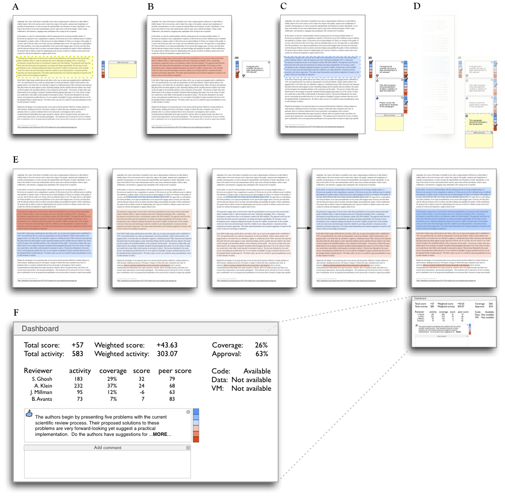

Learning from open source software projects to improve scientific review

Satrajit S. Ghosh1, Arno Klein2, Brian Avants3, K. Jarrod Millman4

1 Research Laboratory of Electronics, Massachusetts Institute of
Technology, Cambridge, MA, USA

2 Division of Molecular Imaging and Neuropathology, New York State
Psychiatric Institute, Columbia University, New York, NY, USA

3 PICSL, Department of Radiology, University of Pennsylvania School of
Medicine, Philadelphia, PA, USA

4 Helen Wills Neuroscience Institute, University of California,
Berkeley, Berkeley, CA, USA

Correspondence:

Dr. Satrajit Ghosh

50 Vassar St

36-587 MIT

Cambridge, MA 02139, USA

Running title: Code review and scientific publications

Abstract

Scientific publications are more available and plentiful than at any
previous point in history. The current review process is, however,
fraught with many problems that undermine the pace, validity, and
credibility of science. Precious few reviewers work in relative
isolation, in a short amount of time, and are not officially
acknowledged. Reviewers also rarely have access to the information
necessary to verify a study’s reproducibility. We argue that these
problems can be addressed by building upon source code management
systems to provide a community of reviewers interactive access to not
only the text, but also (potentially) the data, software and scripts
necessary to replicate the results of a study. Moreover, such systems
enable the community to encourage reviewers by acknowledging the quality
of their contributions. They ensure that the review process itself is
preserved, is timely and has the ability to evolve beyond the
publication date. We demonstrate that technology currently available in
open code review systems support this framework.

Keywords: distributed peer review, code review systems, open source
software development, post-publication peer review

Introduction

Scientific publications continue to be the primary mechanism for
dissemination of scientific information and for establishing precedence
and credit for scientific research. In the current atmosphere of highly
competitive and uncertain research funding, publications are
instrumental in determining how resources are distributed, who gets
promoted, and in which directions research advances. This has cultivated
a publish-or-perish mentality where the focus is on maximizing the
number of publications rather than on the validity and reproducibility
of research findings, and a decrease in the amount of information
apportioned to each article. Peer review is the primary means of
filtering this rapidly growing literature prior to publication in an
effort to ensure quality and validity.

Currently the typical review process for an article involves a
preliminary screening by a journal editor followed by an anonymous and
private review by a very small number of individuals (2 to 5, but often
just 2) presumed to have expertise in the research
topic.\ :sup:``[1] <#ftnt1>`_`\  The editor takes into consideration the
reviewers' recommendations to either publish, reject or request
revisions of the article. After publication, problems such as fraud or
mistakes are addressed via retraction after disclosure or exposure by
countering articles or letters to the editor (e.g. Chang et al., 2006).

Through the review process and the scientific community's history of
policing itself, science is thought to have a self-correcting character.

However, a lack of objective standards for the review process results in
great variability among journals in the percentage and quality of
articles accepted. This has led to a hierarchy in the status of
journals, often quantified by a journal's impact factor (Garfield,
1955). As such, certain journal titles have overtaken the review process
as arbiters of quality and significance of research as well as

With the difficulty for individual reviewers to review the increasing
number and complexity of articles, and the use of journal impact factors
as proxies for evaluations of individual articles, the integrity of the
review process, and indeed of science, suffers (Poschl and Koop, 2008;
Smith, 2006).

Another danger to the review process, and to scientific articles
themselves, is that they are not keeping pace with the dramatic advances
in computing resources by which results are obtained and advances in
media by which results are disseminated.

Thus article acceptance relies on a handful of anonymous and unpublished
opinions

... placing at the gate of scientific communication an undesirable
combination of power and secrecy.

There is also a lack of objective standards for the review process that
results in great variability among journals in the percentage and
quality of articles accepted. This has led to a hierarchy in the status
of journals, often quantified by a journal's impact factor (Garfield,
1955). As such, certain journal titles have overtaken the review process
as arbiters of quality and significance of research as well as . JB:

In contrast, during open source software development, the typical code
review is open, collaborative, and interactive, engaging many
participants with varying levels of expertise. There is a clear process
by which comments get addressed and new code gets integrated into the
main project. An example workflow for accepting code patches into the
Google Android project is shown in Figure 1. Since computer programs are
much more structured and objective than prose, it is more amenable to
standardization and therefore to review. These code review systems also
take advantage of some of the latest technologies and have the potential
to be used for publication review. Despite all of these differences, the
purpose of code review systems mirror the purpose of publication review
to increase the clarity, reproducibility and correctness of
contributions.

For the publication review process to continue to play a critical role
in science, there are a number of problems that need to be addressed. In
this article, we list five problems and potential solutions that derive
from distributed code review in open source software development.

Figure 1. A patch submission workflow for the Android project
(http://source.android.com/source/life-of-a-patch.html)

Problems with current peer-review process

1. Reviewers are expected to have comprehensive expertise.

Reviewers are expected to work in isolation, unable to discuss the
content of an article with the authors or other reviewers. When faced
with an article that may be authored by half a dozen or more experts in
their respective disciplines, how could a few reviewers be expected to
have the range of expertise necessary to adequately understand and gauge
the significance (or insignificance) of all aspects of a given article?
Why are the different components of an article, including the
background, experimental design, methods, analysis of results, and
interpretations handed over as a package to each reviewer, rather than
delegated to many experts in each domain? Realistically, it is common
practice for a reviewer to criticize portions of an article that he or
she understands, is interested in, has time to read, and takes issue
with, while falling silent on the rest of the article. This leads an
editor to assume these silences are indicators of tacit approval. The
unrealistic expectations placed on each of the reviewers, coupled with
the delayed and sequential interactions they have with the authors and
editors, have made the review process unnecessarily tedious, slow, and
inefficient.

2. Reviewers do not have sufficient access to methods and materials to
evaluate a study.

The typical review process does not require submission of data or
software associated with an article (Association for Computing Machinery
Transactions on Mathematical Software was an early exception), and the
descriptions provided in methods sections are often inadequate for
replication. This makes it impossible for a reviewer, if so inclined, to
fully evaluate an article’s methods, data quality, or software, let
alone to replicate the results of the study. Failing to expose the
methods, data, and software underlying a study can lead to needless
misdirection and inefficiency, and even loss of scientific credibility.
One example is the case of Geoffrey Chang, whose rigorous and correct
experimental work was later retracted due to a software bug that
undermined the paper's conclusions (Chang et al., 2006).

3. Reviewers are not acknowledged.

Review is currently considered one's unpaid "duty" to maintain the
standards and credibility of scientific research. The reviewer stands to
gain by early exposure to relevant areas of research, while a publisher
stands to gain financially through either publication or subscription
fees. There is little motivation for potential reviewers to participate
in the review process, and there is a lack of acknowledgment for their
services that could factor into their evaluations for promotion and
funding opportunities.

4. There is no measure of the quality of a review.

There is no attempt to quantify the quality, strength, impartiality, or
expertise of the reviews or reviewers. Without measures associated with
the quality of any portion of a review, the community is forced to trust
the judgment of the editor and the journal’s impact factor as proxies
for quality. This prevents external scrutiny and makes it impossible to
evaluate or standardize the review process.

5. Reviews take a lot of time, and once submitted cannot evolve.

A lengthy review process holds up grant submissions, funding of research
programs, and the progress of science itself. And even after this
process, for the vast majority of articles none of the information
(criticism or feedback) generated during the review is made publicly
available (BioMedCentral is one counterexample). Furthermore, after an
article has been published, the review process simply ends even for
those who participated, as if the work and interpretations of the
results are sealed in a time capsule. Data, methods, analysis, and
interpretations of the results are all a product of their time and
context, and at a later time may not stand up to scrutiny or may yield
new insights.

Proposed re-design of the peer review process

While there are notable examples of journals (e.g., Frontiers -
frontiersin.org, BioMedCentral - biomedcentral.com, PLoS One -
plosone.org) and paper archives (arXiv.org) that address some of the
above individual problems, the vast majority of journals do not. In this
section, we propose an open evaluation system for scientific publishing
that draws on the ideas, experience, and technologies recently developed
to support community code review in open source software projects.
Opening up the review process to everyone, not just to a select few
anonymous reviewers, has the potential to address every one of the
problems raised above. For each of the problems listed above, we first
describe our proposed solution, then highlight the relevance of current
code review systems in addressing the problem and finally describe
enhancements to the current systems to support our proposed solution.

1. Distribute reviews to many reviewers.

Reviewers would no longer work in isolation or necessarily in anonymity,
benefiting from direct, dynamic, and interactive communication with the
authors and the world of potential reviewers. This would help reviewers
to clarify points, resolve ambiguities, receive open collegial advice,
attract feedback from people well outside of the authors' disciplines,
and situate the discussion in the larger scientific community. Because
each reviewer's feedback can be focused on portions of the article that
reflect the reviewer’s specialty or area of interest, there is less
burden placed on any one reviewer, enabling a more comprehensive and
timely review.

\ :sup:``[a] <#cmnt1>`_`\ 

In case there is a fear of disclosure prior to
publication\ :sup:``[2] <#ftnt2>`_`\  or of an overwhelming amount of
participation in a review where anyone could be a reviewer, there are at
least three types of compromise available. One would be to assign
certain reviewers as moderators for different components of the article,
to lessen the burden on the editor. A second would be to restrict the
number of reviewers to those solicited from a pool of experts. This
would still improve scientific rigor while lessening the burden on each
individual reviewer, as long as they review specific components of the
article they are knowledgeable about. A third would be to conduct a
preliminary review consisting of a limited and expedited review process
prior to the full and open review. At different stages of such a tiered
review, reviewers might be assigned different roles, such as mediator,
editor, or commenter.\ :sup:``[b] <#cmnt2>`_`\ 

Relevance of code review systems

In the same manner that articles are submitted for review and
publication in journals, code in collaborative software projects are
submitted for review and integration into a codebase. In both scientific
research and in complex software projects, specialists focus on specific
components of the problem. However, unlike scientific review, code
review is not limited to specialists. When multiple pairs of eyes look
at code, the code improves, bugs are caught, and all participants are
encouraged to write better code. Existing code review systems such as
Gerrit (http://code.google.com/p/gerrit) as well as the collaborative
development and code review functionality provided by hosting services
like GitHub (http://github.com) are built for a distributed review
process and provide reviewers the ability to interact, modify, annotate
and discuss the contents of submitted code changes.

.. figure:: images/image01.png
   :align: center
   :alt: 
Figure 2. A snapshot from the web interface of a request to merge code
into the NiPyPE (nipy.org/nipype) project on GitHub, demonstrating part
of a discussion thread, inline commenting of code (for line 98) as well
as updates on code changes taking place as a function of the discussion.

Indeed, the purpose of these systems mirror the purpose of scientific
review -- to increase the clarity, reproducibility and correctness of
works that enter the canon. While no journals provide a platform for
performing such open and distributed review, the Frontiers journals do
provide an interactive, but non-public discussion forum for authors and
reviewers to improve the quality of a submission after an initial closed
review. In GitHub, code is available for everyone to view and for
registered GitHub members to comment on and report issues on using an
interactive web interface. The interface combines a discussion forum
that allows inserting comments on any given line of code together with a
mechanism for accepting new updates to the code that fix unresolved
issues or address reviewer comments (an example is shown in Figure 2).
These interactive discussions become part of a permanent and open log of
the project.

.. figure:: images/image05.png
   :align: center
   :alt: 
Figure 3. Mock-up of a modified commenting system. The left panel shows
the annotated text from a prior revision of this article and the right
panel shows the reviewer comments. Comments can be linked to multiple
sections of the text and by multiple reviewers.

Enhancing code review systems for article review

These existing code review systems, while suitable for code, have
certain drawbacks for reviewing scientific articles. For example, the
GitHub interface allows line-by-line commenting which reflects the
structure of code. But commenting on an article’s text should follow the
loose structure of prose with comments referring to multiple words,
phrases, sentences or paragraphs in different parts of the text. For
example, a reviewer might come across a sentence in the discussion
section of an article that contradicts two sentences in different parts
of the results section. The interface should allow multiple reviewers to
expose contradictions, unsubstantiated assumptions, and other
inconsistencies across the body of an article or across reviews for the
article. A mock-up of such a system is shown in Figure 3.

2. Provide reviewers materials and methods to perform comprehensive
evaluation.

In a wide-scale, open review, descriptions of experimental designs and
methods would come under greater scrutiny by people from different
fields using different nomenclature, leading to greater clarity and
cross-fertilization of ideas. Software and data quality would also come
under greater scrutiny by people interested in their use for unexpected
applications, pressuring authors to make them available for review as
well, and potentially leading to collaborations, which would not be
possible in a closed review process.

.. figure:: images/image08.png
   :align: center
   :alt: 
Figure 4: A graph generated by the NiPyPE software package captures a
preprocessing workflow for brain image analysis showing which algorithms
and software packages were used. Such information can complement an
article’s methods section.

We propose that data and software (including scripts containing
parameters) be submitted together with the article. This not only
facilitates transparency for all readers including reviewers but also
facilitates reproducibility and encourages method reuse. For example, a
workflow graph from a neuroimaging analysis captures numerous details in
a compact visual form which would otherwise be absent in a methods
section (see Figure 4). Furthermore, several journals (e.g. Science -
sciencemag.org , Proceedings of the National Academy of Sciences -
pnas.org) are now mandating submitting all components necessary to
reproduce the results of a study as part of article submission.

While rerunning an entire study’s analysis might not currently be
feasible as part of a review, simply exposing code can often help
reviewers follow what was done and provides the possibility of
replicating the results in the future. In the long run, virtual machines
or servers may indeed allow standardization of analysis environments and
replication of analyses for every publication.

Relevance of code review systems

While certain journals (e.g., PLoS One, Insight Journal) require code to
be submitted for any article describing software or algorithm
development, most journals do not require submission of relevant
software or data. Currently, it is considered adequate for article
reviewers to simply read a submitted article. However, code reviewers
must not only be able to read the code, they must also see the output of
running the code. To do this they require access to relevant data or to
automated testing results. Code review systems are not meant to store
data, but complement such information by storing the complete history of
the code through software version control systems such as Git
(git-scm.com) and Mercurial (mercurial.selenic.com). In addition to
providing access to this history, these systems also provide other
pertinent details such as problems, their status (whether fixed or not),
timestamps and other enhancements. Furthermore, during software
development, specific versions of the software or particular files are
tagged to reflect milestones during development. Automated testing
results and detailed project histories provide contextual information to
assist reviewers when asked to comment on submitted code.

Enhancing code review systems for article review

As stated earlier, code review systems are built for code, not for data.
In some disciplines (such as neuroimaging) the amount of data can be
large. Code review systems should be coupled with database systems
(e.g., Extensible Neuroimaging Archive Toolkit - XNAT - xnatcentral.org)
to enable storage of such large amounts of data.

3. Acknowledge reviewers

When reviewers are given the opportunity to provide feedback regarding
just the areas they are interested in, the review process becomes much
more enjoyable. But there are additional factors afforded by opening the
review process that will motivate reviewer participation. First, the
review process becomes the dialogue of science, and anyone who engages
in that dialogue gets heard. Second, it transforms the review process
from one of secrecy to one of engaging social discourse. Third, an open
review process makes it possible to quantitatively assess reviewer
contributions, which could lead to assessments for promotions and
grants. There are two things that can be used to acknowledge reviewers.
First, reviewer names (e.g., Frontiers) and contributions (e.g.,
BioMedCentral) are immediately associated with a publication. Second,
measures of review quality eventually become associated with the
reviewer based on community feedback on the reviews.

.. figure:: images/image04.png
   :align: center
   :alt: 
Figure 5: A web page snippet from the Geritt code review system used for
ITK (Insight Toolkit, itk.org). This explicitly lists the reviewers who
are participating in the review.

Relevance of code review systems

In software development, reviewers are acknowledged implicitly by having
their names associated with comments related to a code review. Systems
like Geritt and GitHub explicitly list the reviewers participating in
the review process. An example from Geritt is shown in Figure 5. In
addition, certain social coding websites (e.g., ohloh.net) analyze
contributions of developers to various projects and assign “kudos” to
indicate the involvement of developers, but not necessarily their
proficiency.

Enhancing code review systems for article review

The criterion for accepting code is based on the functionality of the
final code rather than the quality of reviews. As such code review
systems typically do not have a mechanism to acknowledge and quantify
reviewer contributions. We propose that code review systems adapted for
article review include quantitative assessment of the contributions of
reviewers. This would include a weighted combination of the number of
reviews as well as the quality of those reviews as assessed via a metric
described later in this article.

4. Quantify review quality.

Although certain journals hold a limited discussion before a paper is
accepted, it is still behind closed doors and limited to the editor, the
authors, and a small set of reviewers. An open and recorded review
ensures that the role and importance of reviewers and information
generated during the review would be shared and acknowledged. The
quantity and quality of this information (assessed by, for example,
voting) can be used to quantitatively assess the importance of a
submitted article. Such quantification could lead to an objective
standardization of review.

Relevance of code review systems

In general, code review systems use a discussion mechanism, where a code
change is moderated through an iterative process as illustrated in
Figure 1. In the context of code review, there is often an objective
criterion – the code performs as expected and is written using proper
style and documentation. Once these standards are met, the code is
accepted into the main project. The discussion mechanism facilitates
this process. However, in the case of code review, the quality of review
is typically not quantified.

.. figure:: images/image02.png
   :align: center
   :alt: 
Figure 6. A response to a question on stackoverflow.net. The top left
number (299) indicates the number of positive votes this response
received. There are comments to the response itself and the number next
to the comments reflects the number of positive votes for the comment.

Enhancing code review systems for article review

We propose to augment code review systems (and in turn, article review
systems) with a mechanism similar to the one used in discussion forums
such as `stackoverflow.net <http://stackoverflow.net>`_ or
`mathoverflow.net <http://mathoverflow.net>`_ in order to quantify the
quality of reviews. These sites provide a web interface for soliciting
responses to questions on topics related to either computer programming
or mathematics, respectively. The web interface allows registered
members to post or respond to a question, to comment on a response, and
to vote on the quality or importance of a question, of a response, or of
a comment. Figure 6 shows a screenshot of the response from a registered
member to a question submitted to Stack Overflow, where 299 indicates
the number of votes received for the response from registered members.

5. Expedite reviews and allow for post-publication review.

Once open and online, reviews can be dynamic, interactive, and conducted
in real time (e.g., Frontiers). And with the participation of many
reviewers, they can choose to review only those articles and components
of those articles that match their expertise and interests. Not only
would these two changes make the review process more enjoyable, but they
would expedite the review process. And there is no reason for a review
process to end after an article has been published. The article can
continue as a living document, where the dialogue can continue and
flourish (see Figure 7), and references to different articles could be
supplemented with references to the comments about these articles,
firmly establishing these communications within the dialogue and
provenance of science, where science serves not just as a method or
philosophy, but as a social endeavor. This could make scientific review
and science a more welcoming community, and a more desirable career
choice.

.. figure:: images/image00.gif
   :align: center
   :alt: 
Figure 7. A visualization of the evolutionary history of a Wikipedia
entry (“Evolution”) as an example of an evolving body of text. History
flow is a tool for visualizing dynamic, evolving documents and the
interactions of multiple collaborating authors
(http://www.research.ibm.com/visual/projects/history\_flow/gallery.htm
by Fernanda B. Viégas and Martin Wattenberg at IBM, 2003)

Relevance of code review systems

Code review requires participation from people with differing degrees of
expertise and knowledge of the project. This leads to higher quality of
the code as well as faster development than individual programmers could
normally contribute. These contributions can also be made well beyond
the initial code review allowing for bugs to be detected and
improvements to be made by new contributors.

Enhancing code review systems for article review

Current code review systems have components for expedited and continued
review. Where they could stand to be improved is in their visual
interfaces, to make them more intuitive for a non-programmer to quickly
navigate, and to enable a temporal view of the evolutionary history of
an arbitrary section of text, analogous to Figure 7 (except as an
interactive tool).

Quantifying an open-review system

There exist metrics for quantifying the importance of an author,
article, or journal (Hirsch, 2005; Bollen et al., 2009), but we know of
no metric used in either article review or in code review for
quantifying the quality, impact, or importance of a review, of a comment
on a review, or of any portions thereof. Metrics have many uses in this
context, including constructing a dynamic assessment of individuals or
ideas (as in the Stack Overflow example in Figure 6) for use in
promotion and allocation of funds and resources. Metrics also make it
possible to mine reviews and comment histories to study the process of
scientific publication. The classic “Like” tally used to indicate
appreciation of a contribution in Digg, Facebook, etc., is the most
obvious measure assigned by a community, but it is simplistic and vague.
In addition to slow and direct measures of impact such as the number of
times an article is cited, there are faster, indirect behavioral
measures of interest as a proxy for impact that can be derived from
clickstream data, web usage, and number of article downloads. Other
possibilities include measuring the activity, frequency (Figure 8),
impact (Figure 9), and topic range of an author or reviewer or their
contributions over time.

It would also be possible to aggregate these metrics to assess the
impact or importance of, for example, collaborators, coauthors,
institutions, or different areas of multidisciplinary research. As
simple examples, one could add the number of quotations by two or more
individuals in Figure 8 or the impact of two or more coders in Figure 9.
This could be useful in determining what decision to make regarding a
statement in an article in the following scenario. Half of a pool of
reviewers A agrees with the statement and the other half B disagrees
with the statement. A decision in favor of group A could be made if the
aggregate metric evaluating A’s expertise on the statement’s topic is
higher than that of B. However, such decisions will only be possible
once this system has acquired a sufficient amount of data about group A
and B’s expertise on reviewing this topic.

A third possibility is that authors assign impact ratings to the review
or segments of the review. Therefore, the authors will be able to
quantitatively evaluate the reviewers. This additional measurement can
be entered into the reviewer database. We acknowledge some reviewers
might be discouraged by this idea, thus it may be optional to
participate.

.. figure:: images/image06.png
   :align: center
   :alt: 
Figure 8. Example of a metric for quantifying contributor frequency.
Quotes over Time (www.qovert.info) tracked the top-quoted people from
Reuters Alertnet News on a range of topics, and presents their quotes on
a timeline, where color denotes the identity of a speaker and bar height
the number of times the speaker was quoted on a given day.

.. figure:: images/image03.png
   :align: center
   :alt: 
Figure 9. Example of a metric for quantifying contributions over time.
This is a screenshot of a ribbon chart visualization in GitHub of the
history of code additions to a project, where each color indicates an
individual contributor and the width of a colored ribbon represents that
individual’s “impact” or contributions during a week-long period.

Discussion

In this article, we raise five problems with the current process for
reviewing scientific articles, and argue that we could address all of
these problems by opening up the review process to include many
reviewers, provide them with the data and software to replicate a study,
acknowledge their contributions, quantify the quality of their
contributions, and ensure that reviews are timely and live on beyond the
publication date. We propose that an effective means for implementing
these changes would be to enhance current code review systems for
software development to support article review.

The writing of this article was conducted in the spirit of the content
of the article, with multiple authors and peer reviewers contributing
primarily via GitHub (github.com/satra/scientific-review), followed by
dynamic, interactive, real-time collaboration via Google Docs
(docs.google.com). We found the collaborative editing and reviewing
through the use of these tools to be enjoyable and efficient, while
exposing some of the above-mentioned limitations of code review systems
for use in article review. Had we solicited many reviewers, we could
have experienced more of the real-world challenges of such an open
review system. First, as in the content of this article, we assumed that
the reviewers did not have selfish motives or egotistical attitudes that
affected their reviews. Second, we reached a consensus on most issues,
resulting in a very rapid process of writing and reviewing, without
conflicts or deadlock. Third, because we had to meet the submission
deadline for this article, one or another of us took some decisions on
remaining issues without seeking approval from all other reviewers. All
three of these point to the problem of reviewers reaching a consensus so
that the article could be published in a timely manner. This may be
handled by not requiring a consensus, but instead by exploiting metrics
that quantify the quality of the reviews and comments on these reviews
to make a decision, as discussed earlier.

It may not be practical to immediately adopt the open review process
proposed in this article and will require a change of culture that many
researchers may resist. Some journals have already adopted aspects of
our proposed system (e.g., Frontiers, BioMed Central, Science, PNAS,
PLoS One). Initially, our full proposal could be implemented as a part
of the post-publication system, alongside a more traditional anonymous
peer review system (e.g., Atmospheric Chemistry and Physics,
atmos-chem-phys.net). As scientists gain familiarity and journals gain
experience with our proposed system, it could be refined and improved.
In the long run, the review process need not be limited to publication,
but can be engaged throughout the process of research, from inception
through planning, execution, and documentation (Butler, 2005). This
facilitates collaborative research and also ensures that optimal
decisions are taken at every stage in the evolution of a project.

In this article, we have proposed a re-design of the current peer review
system by incorporating ideas from code review systems associated with
open source software development. Such a system should enable an
unbiased, comprehensive, and efficient review of scientific work while
ensuring a continued, evolving, public dialogue.

Acknowledgements

We would like to thank Fernando Perez for his helpful comments. Arno
Klein would like to thank Deepanjana and Ellora, as well as the NIMH for
their support via R01 grant MH084029.

--------------

References

Bollen, J., Van de Sompel, H., Hagberg, A., and Chute, R. (2009). A
principal component analysis of 39 scientific impact measures. PLoS ONE,
4(6):e6022.

Butler, D. (2005). Electronic notebooks: A new leaf. Nature,
436(7047):20–21.

Chang, G., Roth, C. B., Reyes, C. L., Pornillos, O., Chen, Y.-J., and
Chen, A. P. (2006). Retraction. Science,

314(5807):1875.

Garfield, E. (1955). Citation indexes to science: a new dimension in
documentation through association of ideas. Science, 122(3159):108–11.

Hirsch, J. (2005). An index to quantify an individual’s scientific
research output. Proceedings of the National Academy of Sciences of the
United States of America, 102(46):16569.

Poschl, U. and Koop, T. (2008). Interactive open access publishing and
collaborative peer review for improved scientific communication and
quality assurance. Information Services and Use, 28(2):105–107.

Smith, R. (2006). Peer review: a flawed process at the heart of science
and journals. Journal of the Royal Society of Medicine,
99(4):178.\ :sup:``[c] <#cmnt3>`_`\ 

--------------

`[1] <#ftnt_ref1>`_Currently, reviewers are solicited by the editors of
journals based on either names recommended by the authors who submitted
the article, the editors' knowledge of the domain or from an internal
journal reviewer database. This selection process results in a very
narrow and biased selection of reviewers. An alternative way to solicit
reviewers is to broadcast an article to a pool of reviewers and to let
reviewers choose articles and components of the article they want to
review. These are ideas that have already been implemented in scientific
publishing. The Frontiers system (frontiersin.org) solicits reviews from
a select group of review editors and the Brain and Behavioral Sciences
publication
(http://journals.cambridge.org/action/displayJournal?jid=BBS) solicits
commentary from the community.

`[2] <#ftnt_ref2>`_To allay concerns over worldwide pre-publication
exposure, precedence could be documented by submission and revision
timestamps acknowledging who performed the research.

`[a] <#cmnt_ref1>`_jbpoline:

if each part of a paper is reviewed by an expert, this will lead to a
very harsh review process?

--------------

yarikoptic:

moreover, reviewing parts by different people is probably applicable

only for the verification of technical aspects. Quite often

conceptual problems could be unraveled only after reading the full

paper, thus poking at parts of the paper might be more destructive

than constructive.... let me review last 3 pages of your paper and see
how it goes ;-)

`[b] <#cmnt_ref2>`_yarikoptic:

I think that all 3 suggested strategies are just refinements for the

existing system, thus not addressing the problem at the root. Since

you are suggesting different metrics to rate reviews, actual papers

could be rated using similar metrics... Now lets join suggested

approach 3 (quick limited review) with a truly novel feature: "article

gets accepted!" at this stage. Now, authors are safe -- paper is

accepted and it is safe to disclose EVERYTHING, we get papers

supporting null-hypothesis (as might be unraveled later in the review

process) accepted, thus mistakes are not repeated (as it is now). And

here it is where the "review" and "rating" process kicks in, taking

article apart and making it a candy. It would remain in the best

interest of the authors that all reviewers' concerns are addressed,

because then the article itself would receive a low rating and thus

penalizing author's position in some hypothetical rating-list.

And then, some articles (good resultant review) get pronounced, while
bad ones, although "published", would remain somewhere in the tail of
the announcements of new "issues".

How about that?

--------------

yarikoptic:

additional benefit: we all know about some papers which get bounced

through the chains of journals, until they are all syntactically

correct remain scientific nonsense. Sooner or later they do get

published in some journal. That wastes lots of editors/review effort

at every step of the paper journey. With the suggestion above, paper

gets accepted at the initial step, and then reviewed once; thus saving

everyone time.

`[c] <#cmnt_ref3>`_yarikoptic:

Although not a publication per se but imho worth mentioning:
http://futureofscipub.wordpress.com/ from Nikolaus Kriegeskorte

`[d] <#cmnt_ref4>`_binarybottle:

Science suffers. We suffer. We conclude.

that technology used in open code review systems should be adipated to
explicate the need for the current armamenteric \_adjective\_ evil
\_armamentarium\_. with the exception for the journal for irreproducible
results.

--------------

satrajit.ghosh:

In this abstract, you will see that we are EXTREMELY right and they are
VERY wrong. It will be a slow and gruelling, uphill battle, but we will
win it in the end. fini.

`[e] <#cmnt_ref5>`_fdo.perez:

the issue of positive results bias is a very important (and widely
studied) one, but it's really a little separate from the title of this
section, and I think it's a distraction to conflate it here. The title
of the section starts talking about one thing, and then the text goes
off in a different direction.

`[f] <#cmnt_ref6>`_fdo.perez:

While I understand where you come from and agree with the idea, it may
sound a bit over the top to put "the integrity of science" in question
right up front. I think a statement that strong should perhaps be
reached after some more elaboration... Just a thought.

`[g] <#cmnt_ref7>`_stnava:

move elsewhere

`[h] <#cmnt_ref8>`_binarybottle:

if and in which journal an article

`[i] <#cmnt_ref9>`_kimlumbard:

Howdy all!

I believe you can profitably mine the parallel between code development
and peer review. You may want to take a look at Agile Development and
SCRUM; these outline two simple methodologies for the timely production
of code with client feedback. This would yield a tighter integration of
the whole scientific process (i.e. including both those who fund and
those who technologize).

Btw, the review process is much more complex than is being portrayed
here. When one reviews a paper, there are considerations of content,
correctness, culture, format, presentation, relevance, and audience, to
name a few. The code parallel might also be helpful here, insofar as
code has ancillary metrics of format and correctness.

Last but not least, your statements about "compromising the integrity of
science" are perhaps too strong, because they are inaccurate. There are
branches of science where frequent incremental publication is the
optimal distribution of information; quantity does not preclude quality.
Moreover, science is a human endeavor rife with social context. As such,
bias, elitism, etc. can also be part of a desirable self-focusing
feedback cycle.

I'm in complete agreement that review should be fundamentally altered,
and that scientists and not publishing companies should direct the
process. You'll get wider acceptance if your theme is "we should use
practices well-known in other fields to reliably improve the quality of
the review process" than "we are here to save the integrity of science
from the evil idiots who are handling it now." ;-P

Bon chance!

--------------

binarybottle:

thank you, kim!

`[j] <#cmnt_ref10>`_millman.ucb:

update at the end to include everyone

`[k] <#cmnt_ref11>`_fdo.perez:

Frontiers has this already in its editorial policy

`[l] <#cmnt_ref12>`_fdo.perez:

This sentence parses really weird

`[m] <#cmnt_ref13>`_fdo.perez:

Be careful with how this argument is constructed. Above you point out
the detrimental effects of the crazy focus on all kinds of publication
impact metrics, yet here you seem to be arguing for similar metrics in
the review process...

`[n] <#cmnt_ref14>`_fdo.perez:

this feels out of place and just like listing a 'feel good' idea,
insufficiently developed.

`[o] <#cmnt_ref15>`_binarybottle:

and are followed up by

`[p] <#cmnt_ref16>`_binarybottle:

if this article is about the review process, a separate section on
reproducible research seems out of place. perhaps we should say
something to indicate that involvement of reviewers could range from
out-of-field comments to direct requests for software or data to try to
test or replicate work in the article. we can't expect every article to
provide a unit-test-like framework to replicate a study, but we could
evaluate the reproducibility of the work in a given article to indicate
how far one could take a review, from comment to re-run the study!

`[q] <#cmnt_ref17>`_fdo.perez:

While this is important, I think it's a bit of low-level technical
minutiae, out of place when you are discussing larger scope issues

`[r] <#cmnt_ref18>`_fdo.perez:

??? What is this?

`[s] <#cmnt_ref19>`_fdo.perez:

Don't engage in solution proposals here, since you're so far just
statinng the various problems...
