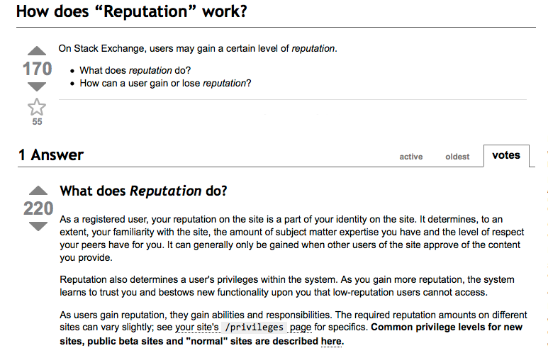
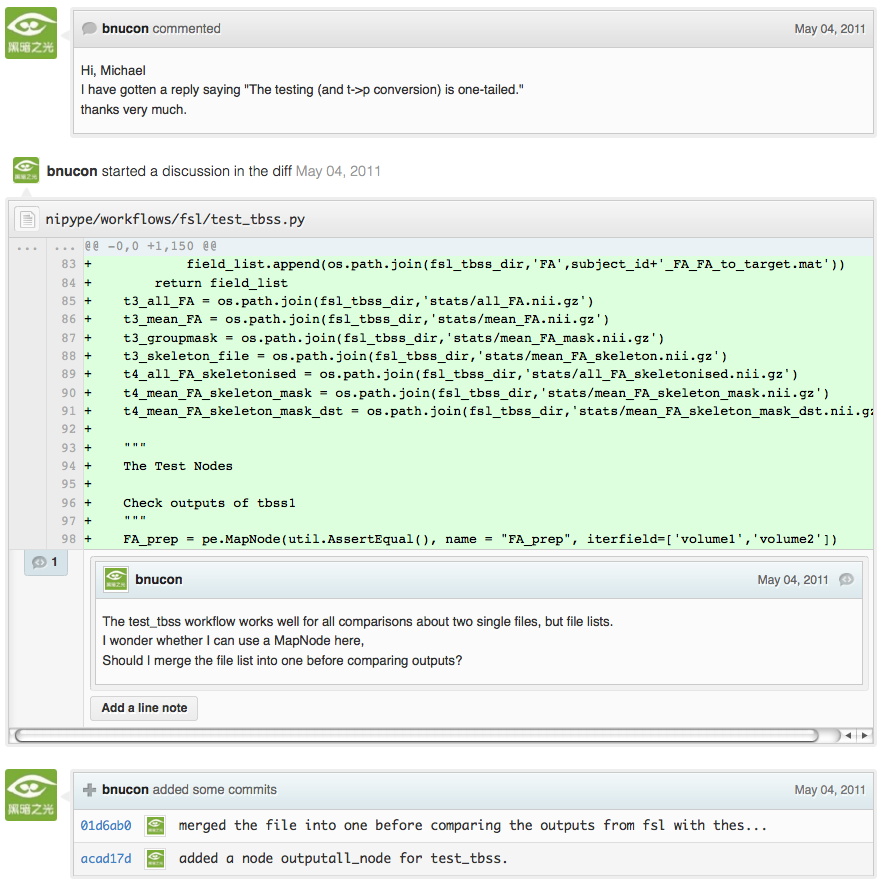

Learning from open-source software projects to improve scientific review

Satrajit S. Ghosh1, Arno Klein2, Brian Avants3, K. Jarrod Millman4

1 Research Laboratory of Electronics, Massachusetts Institute of
Technology, Cambridge, MA, USA

2 Division of Molecular Imaging and Neuropathology, New York State
Psychiatric Institute, Columbia University, New York, NY, USA

3 PICSL, Department of Radiology, University of Pennsylvania School of
Medicine, Philadelphia, PA, USA

4 Helen Wills Neuroscience Institute, University of California,
Berkeley, Berkeley, CA, USA

Correspondence:

Dr. Satrajit Ghosh

50 Vassar St

36-587 MIT

Cambridge, MA 02139, USA

Running title: Reviewing with open-source software systems

Abstract

The current review process for scientific publications is fraught with
many problems that undermine the pace, validity, and credibility of
science. These problems include: reviewers are expected to have
comprehensive expertise, do not have sufficient access to methods and
materials to evaluate a study, and are typically anonymous and not
acknowledged; there is no measure of the quality of a review; and
reviews take a lot of time and once submitted cannot evolve. To address
these problems, we propose an open review process that draws on the
ideas, experience, and technologies developed to support code review in
open source software projects.

Keywords: distributed peer review, code review systems, open-source
software development

Introduction

Peer-reviewed scientific publications continue to be the primary
mechanism for dissemination of scientific information and for
establishing precedence and credit for scientific research. In the
current atmosphere of highly competitive and uncertain research funding,
publications are instrumental in determining how resources are
distributed, who gets promoted, and in which directions research
advances. This has cultivated a publish-or-perish mentality where the
focus is on maximizing the number of publications rather than on the
validity and reproducibility of research findings, and a decrease in the
amount of information apportioned to each article. Moreover, the lack of
objective standards for the review process results in great variability
in the percentage and quality of articles accepted. This has led to a
hierarchy in the status of journals, often quantified by a journal's
impact factor (Garfield, 1955). As such, certain journal titles are
taken as arbiters of quality and significance of published works instead
of the review process.

Currently the typical review process for an article involves a
preliminary screening by a journal editor followed by an anonymous and
private review, typically by a small group of (3-5) peers presumed to
have expertise in the research topic.\ :sup:``[1] <#ftnt1>`_`\  The
journal editor takes into consideration the reviewers' recommendations
to either publish, reject or request revisions of the article. After
publication, problems such as fraud or mistakes are addressed via
retraction after disclosure or exposure by countering articles or
letters to the editor (e.g. Chang et al., 2006). Through the review
process and the scientific community's history of policing itself,
science is thought to have a self-correcting character. However, with
the difficulty for individual reviewers to review the increasing number
and complexity of articles, and the use of journal impact factors as
proxies for evaluations of individual articles, the integrity of the
review process, and indeed of science, suffers. Another danger to the
review process, and to scientific articles themselves, is that they are
not keeping pace with the dramatic advances in computing resources by
which results are obtained and advances in media by which results are
disseminated.

In contrast, during open source software development, the typical review
process for programs (code review) during software development is often
open, collaborative, and interactive, engaging many participants with
varying levels of expertise. There is a clear process by which comments
get addressed and new code gets integrated into the main project. An
example review workflow for the Android project is shown in Figure 1.
Since computer programs are much more structured and objective than
prose, it is more amenable to standardization and therefore to review.
These code review systems also take advantage of some of the latest
technologies and have the potential to be used for publication review.
Despite all of these differences, the purpose of code review systems
mirror the purpose of publication review to increase the clarity,
reproducibility and correctness of contributions.

For the publication review process to continue to play a critical role
in science, there are a number of problems that need to be addressed. In
this article, we list five problems and potential solutions that derive
from distributed code review in open source software development.

Figure 1. A review workflow for the Android project.

Problems with current peer-review system

1. Reviewers are expected to have comprehensive expertise.

Reviewers are expected to work in isolation, unable to discuss the
content of an article with the authors or other reviewers. When faced
with an article that may be authored by half a dozen or more experts in
their respective disciplines, how could a few reviewers be expected to
have the range of expertise necessary to adequately understand and gauge
the significance (or insignificance) of all aspects of a given article?
Why are the different components of an article, including the
background, experimental design, methods, analysis of results, and
interpretations handed over as a package to each reviewer, rather than
delegated to many experts in each domain? Realistically, it is common
practice for a reviewer to criticize portions of an article that he or
she understands, is interested in, has time to read, and takes issue
with, while falling silent on the rest of the article. This leads an
editor to falsely assume that uncommented portions have met with
approval. The unrealistic expectations placed on each of the reviewers,
coupled with the delayed and sequential interactions they have with the
authors and editors, have made the review process unnecessarily tedious,
slow, and inefficient.

2. Reviewers do not have sufficient access to methods and materials to
evaluate a study.

The typical review process does not require submission of data or
software associated with an article (ACM TOMS is an early exception),
and the descriptions provided in methods sections are often inadequate
for replication. This makes it impossible for a reviewer, if so
inclined, to fully evaluate an article’s methods, data quality, or
software, let alone to replicate the analysis of the study. Failing to
expose the methods, data, and software underlying a study can lead to
needless misdirection and inefficiency, and even loss of scientific
credibility. One example is the case of Geoffrey Chang, whose rigorous
and correct experimental work was later retracted due to a software bug
that undermined the paper's conclusions (Chang et al., 2006).

3. Reviewers are not acknowledged.

Reviewing is currently considered one's unpaid "duty" to maintain the
standards and credibility of scientific research. The reviewer stands to
gain by early exposure to relevant areas of research, while a publisher
stands to gain financially through either publication or subscription
fees.There is little motivation for potential reviewers to participate
in the review process, and a lack of acknowledgment for their services
(as in Frontiers journals) that could factor into their evaluations for
promotion and funding opportunities .

4. There is no measure of the quality of a review.

There is no attempt to quantify the quality, strength, impartiality, or
expertise of the reviews or reviewers. Without measures associated with
the quality of any portion of a review, the community is forced to trust
the judgment of the editor and the journal’s impact factor as proxies
for quality. This prevents external scrutiny, data mining, and makes it
impossible to evaluate or standardize the review process.

5. Reviews take a lot of time, and once submitted cannot evolve.

A lengthy review process holds up grant submissions, funding of research
programs, and the progress of science itself. And even after this
process, for the vast majority of articles none of the information
(criticism or feedback) generated during the review is made publicly
available (BioMed Central is one counterexample). Furthermore, after an
article has been published, the review process simply ends even for
those who participated, as if the work and interpretations of the
results are sealed in a time capsule. Data, methods, analysis, and
interpretations of the results are all a product of their time and
context, and at a later time may not stand up to scrutiny or may yield
new insights.

Proposed re-design of the peer review system

While there are notable examples of journals (e.g., Frontiers -
frontiersin.org, BioMedCentral - biomedcentral.com, PLoS One -
plosone.org) and paper archives (arXiv.org) that address some of the
above individual problems, the vast majority of journals do not. In this
section, we address all of these problems by proposing an open
evaluation system for scientific publishing that draws on the ideas,
experience, and technologies recently developed to support community
code review in open source software projects. Opening up the review
process to everyone, not just to a select few anonymous reviewers, has
the potential to address every one of the problems raised above.

1. Distribute reviews to many reviewers.

Reviewers would no longer work in isolation or necessarily in anonymity,
benefiting from direct, dynamic, and interactive communication with the
authors and the world of potential reviewers. This would help reviewers
to clarify points, resolve ambiguities, receive open collegial advice,
attract feedback from people well outside of the authors' disciplines,
and situate the discussion in the larger scientific community. Because
each reviewer's feedback can be focused on portions of the article that
reflect the reviewer’s specialty or area of interest, there is less
burden placed on any one reviewer, enabling a more comprehensive and
timely review.

In case there is a fear of disclosure prior to
publication\ :sup:``[2] <#ftnt2>`_`\  or of an overwhelming amount of
participation in a review where anyone could be a reviewer, there are at
least three types of compromise available. One would be to assign
certain reviewers as moderators for different components of the article,
to lessen the burden on the editor. A second would be to restrict the
number of reviewers to those solicited from a pool of experts. This
would still improve scientific rigor while lessening the burden on each
individual reviewer, as long as they review specific components of the
article they are knowledgeable about. A third would be to conduct a
preview consisting of a limited and expedited review process preceding a
full and open review. At different stages of such a tiered review,
reviewers might be assigned different roles, such as mediator, editor,
or commenter.

Relevance of code review systems

In the same manner that articles are submitted for review and
publication in journals, code in collaborative software projects are
submitted for review and integration into a codebase. In both scientific
research and in complex software projects, specialists focus on specific
components of the problem. However, unlike scientific review, code
review is not limited to specialists. When multiple pairs of eyes look
at code, the code improves, bugs are caught, and all participants are
encouraged to write better code. Existing code review systems such as
Gerrit (http://code.google.com/p/gerrit) and GitHub (http://github.com)
are built for such a distributed review process and provide reviewers
the ability to interact, modify, annotate and discuss the contents of
submitted code changes. Indeed, the purpose of these systems mirror the
purpose of scientific review to increase the clarity, reproducibility
and correctness of works that enter the canon. While no journals provide
a platform for performing for such open and distributed review, the
Frontiers journals do provide an interactive discussion forum for
authors and reviewers to improve the quality of a submission after an
initial closed review. In GitHub, code is available for everyone to view
and for registered GitHub members to comment on and report issues using
an interactive web interface. The interface combines a discussion forum
that allows inserting comments on any given line of code together with a
mechanism for accepting new updates to the code that fix unresolved
issues or address reviewer comments (an example is shown in Figure 2).
These interactive discussions become part of a permanent and open log of
the project.

Figure 2. A snapshot from the web interface of a pull request of the
NiPyPE (nipy.org/nipype) project on GitHub, demonstrating part of a
discussion thread, inline commenting of code (for line 98) as well as
updates on code changes taking place as a function of the discussion.

Enhancing code review systems for article review

These existing code review systems, while suitable for code, have
certain drawbacks for reviewing scientific articles. For example, the
GitHub interface allows line-by-line commenting which reflects the
structure of code. But commenting on an article’s text should follow the
loose structure of prose with comments referring to multiple words,
phrases, sentences or paragraphs in different parts of the text. For
example, a reviewer might come across a sentence in the discussion
section of an article that contradicts two sentences in different parts
of the results section. The interface should allow multiple reviewers to
expose contradictions, unsubstantiated pretexts, and other
inconsistencies across the body of an article or across reviews for the
article. A mock-up of such a system is shown in Figure 3.

Figure 3. Mock-up of a modified commenting system.

2. Provide reviewers materials and methods to perform comprehensive
evaluation.

In a wide-scale, open review, descriptions of experimental designs and
methods would come under greater scrutiny by people from different
fields using different nomenclature, leading to greater clarity and
cross-fertilization of ideas. Software and data quality would also come
under greater scrutiny by people interested in their use for unexpected
applications, pressuring authors to make them available for review as
well, and potentially leading to collaborations, which would not be
possible in a closed review process.

We propose that data and software be submitted together with the
article. This not only facilitates transparency for all readers
including reviewers but also facilitates reproducibility and encourages
method reuse. For example, a workflow graph (for example, Fig. 4) from a
neuroimaging analysis captures numerous details in a compact visual form
which would otherwise be absent in a methods section. Furthermore,
several journals (e.g. Science -
`sciencemag.org <http://sciencemag.org>`_ , Proceedings of the National
Academy of Sciences - pnas.org) are now mandating submitting all
components necessary to reproduce the results of the study as part of
article submission.

.. figure:: images/image05.png
   :align: center
   :alt: 
Figure 4: A graph generated by the NiPyPE software package captures a
preprocessing workflow for brain image analysis showing which algorithms
and software packages were used. Such information can complement an
article’s methods section.

While rerunning an entire study’s analysis might not be currently
feasible as part of a review process, simply exposing code can often
help reviewers follow what was done and allows for replication of the
results in the future. In the long run, virtual machines or servers may
indeed allow standardization of analysis environments and replication of
analyses for every publication.

Relevance of code review systems

While certain journals (e.g., PLoS One, Insight Journal) require code to
be submitted for any article describing software or algorithm
development, most journals do not require submission of relevant
software or data. Currently, it is considered adequate for article
reviewers to simply read a submitted article. However, code reviewers
must not only be able to read the code, they must also see the output of
running the code. To do this they require access to relevant data or to
automated testing results. Code review systems are not meant to store
data, but complement such information by storing the complete history of
the code through software version control systems such as Git
(git-scm.com) and Mercurial (mercurial.selenic.com). In addition to
providing access to this history, these systems also provide other
pertinent details such as problems, their status (whether fixed or not),
timestamps and other enhancements. Furthermore, during software
development, specific versions of the software or particular files are
tagged to reflect milestones during development. Such testing data and
history of the project provide sufficient contextual information for a
reviewer to comment on submitted code.

Enhancing code review systems for article review

As stated earlier, code review systems are built for code, not for data.
In some disciplines (such as neuroimaging) the amount of data can be
large. Code review systems should be coupled with database systems
(e.g., Extensible Neuroimaging Archive Toolkit - XNAT) to enable storage
of such large amounts of data.

3. Acknowledge reviewers

When reviewers are given the opportunity to provide feedback regarding
just the areas they are interested in, the review process becomes much
more enjoyable. But there are additional factors afforded by opening the
review process that will motivate reviewer participation. First, the
review process becomes the dialogue of science, and anyone who engages
in that dialogue gets heard. Second, it transforms the review process
from one of secrecy to one of engaging social discourse. Third, an open
review process makes it possible to quantitatively assess reviewer
contributions, which could lead to assessments for promotions and
grants. There are two things that can be used to acknowledge reviewers.
First, reviewer names (e.g., Frontiers) and contributions (e.g.,
BioMedCentral) are immediately associated with the publication. Second,
measures of review quality eventually become associated with the
reviewer based on community feedback on the reviews.

Relevance of code review systems

In software development, reviewers are acknowledged implicitly by having
their names associated with comments related to a code review. Other
systems, like Geritt and GitHub explicitly list the reviewers
participating in the review process. An example from Geritt is shown in
Figure 5.

Figure 5: A web page snippet from the Geritt code review system used for
ITK (Insight Toolkit, itk.org). This explicitly lists the reviewers who
are participating in the review.

Certain software

Enhancing code review systems for article review

The criterion for accepting code is based on the functionality of the
final code rather than the quality of reviews. As such code review
systems typically do not have a mechanism to acknowledge and quantify
reviewer contributions. We propose that code review systems adapted for
article review include quantitative assessment of the contributions of
reviewers. This would include a weighted combination of the number of
reviews as well as the quality of those reviews as assessed via a metric
described next.

4. Quantify review quality.

Although certain journals hold a limited discussion before a paper is
accepted, it is still behind closed doors and limited to the editor, the
authors, and a small set of reviewers. An open and recorded review
ensures that the role and importance of reviewers and information
generated during the review would be shared and acknowledged. The
exchanges themselves can be used to quantitatively assess the importance
of a submission, and analysis of the review process then becomes
possible and could lead to an objective standardization of the
scientific process.

Relevance of code review systems

In general, code review systems use a discussion mechanism, where a code
change is moderated through an iterative process as illustrated earlier
in Figure 1. In the context of code review, there is often an objective
criterion - the code performs as expected and is written using proper
style and documentation. Once these standards are met, the code is
accepted into the main project. The discussion mechanism facilitates
this process. However, in the case of code review, the quality of review
is typically not quantified.

Enhancing code review systems for article review

We propose to augment code review systems (and in turn, article review
systems) with a mechanism similar to the one used in discussion forums
such as `stackoverflow.net <http://stackoverflow.net>`_ or
`mathoverflow.net <http://mathoverflow.net>`_ in order to quantify the
quality of reviews. These sites provide a web interface for soliciting
responses to questions for either computer programming related topics or
mathematics respectively. The web interface allows registered members to
post or respond to a question, to comment on a response, to vote on the
quality or importance of a question, of a response or of a comment.
Figure 6 below shows a screenshot of the response from a registered
member to a question submitted to Stack Overflow.

.. figure:: images/image01.png
   :align: center
   :alt: 
Figure 6. A response to a question on stackoverflow.net. The top left
number indicates the number of positive votes this response received.
There are comments to the response itself and the number next to the
comments reflects the number of positive votes for the comment.

5. Expedite reviews and allow for post-publication review.

Once open and online, reviews can be dynamic, interactive, and conducted
in real time (e.g., Frontiers). And with many reviewers, they can choose
to review only those articles and components of those articles that
match their expertise and interests. Not only would these two changes
make the review process more enjoyable, but they would expedite the
review process. And there is no reason for a review process to end after
an article has been published. The article can continue as a living
document, where the dialogue can continue and flourish, and references
to different articles could be supplemented with references to the
comments about these articles, firmly establishing these communications
within the dialogue and provenance of science, where science serves not
just as a method or philosophy, but as a social endeavor. This could
make scientific review and science a more welcoming community, and more
desirable career choice.

Relevance of code review systems

Code review invites and requires participation from people with
differing degrees of expertise and knowledge of the project. This leads
to higher quality of the code as well as faster development than
individual programmers could normally contribute. These contributions
are also made well beyond the initial code review allowing for bugs to
be detected and improvements to be made. Extending the life of the
review process beyond initial review could result in similar benefits.

Enhancing code review systems for article review

Current code review systems have components for expedited and continued
review. However, one cannot perform reviews that cross-link different
code review systems (e.g., Git- vs. Mercurial-based systems). In the
context of scientific publications, we recommend that reviews be shared
among such systems similar to the Neuroscience Peer Review Consortium
(http://nprc.incf.org).

Quantifying an open-review system

Integral of discussions over time (by paper, author, reviewer) weighted
by “like” factor of each comment or discussion. This is illustrated in
the figure below.

.. figure:: images/image02.png
   :align: center
   :alt: 
Figure X. Example of a metric for quantifying contributions over time.
Quotes over Time (www.qovert.info) tracked the top-quoted people from
Reuters Alertnet News on a range of topics, and presents their quotes on
a timeline, where color denotes the identity of a speaker and bar height
the number of times the speaker was quoted in a given time period.

Discussion

The writing of this article was conducted in the spirit of the content
of the article, with multiple authors and peer reviewers contributing
primarily via GitHub (github.com/satra/scientific-review), followed by
dynamic, interactive, real-time collaboration via Google Docs
(docs.google.com). We found the collaborative editing and reviewing
through the use of these tools to be enjoyable and efficient, but If we
had solicited many reviewers, problems would have arisen that are we did
not at such a small scale. First, as in the content of this article, we
assumed that the reviewers did not have selfish motives or egotistical
attitudes that affected their reviews. Second, we reached a consensus on
most issues, resulting in a very rapid process of writing and reviewing,
without conflicts or deadlock. Third, because we had to meet the
submission deadline for this article, one or another of us took some
decisions without seeking approval from all other reviewers. All three
of these point to the problem of reviewers reaching an agreement so that
the article could be published in a timely manner.

In the long run, the review process need not be limited to publication,
but can be engaged throughout the process of research, from inception
through planning, execution, and documentation [cite: Nature editorial
on e-lab notebooks]. This facilitates collaborative research and also
ensures that optimal decisions are taken at every stage in the evolution
of a

project.

As mentioned earlier, a number of the ideas presented in this article
have already been adopted by various journal publishing entities.
(`http://www.the-scientist.com/article/display/57601/#ixzz1MKhYtfZG <http://www.the-scientist.com/article/display/57601/#ixzz1MKhYtfZG>`_)

Reviewers are biased by personal motives

Solution: Eliminate anonymous peer review ( Biology Direct, BMJ, BMC);
run open peer review alongside traditional review (Atmospheric Chemistry
and Physics); judge a paper based only on scientific soundness, not
impact or scope

(PLoS ONE)

access to criticism and feedback can spur new directions of research

PEP Talk -- guidelines vs restrictions

References

Begg, C., Cho, M., Eastwood, S., Horton, R., Moher, D., Olkin, I.,
Pitkin, R., Rennie, D., Schulz, K., Simel, D., et al. (1996). Improving
the quality of reporting of randomized controlled trials. JAMA: the
journal of the American Medical Association, 276(8):637.

Brazma, A., Hingamp, P., Quackenbush, J., Sherlock, G., Spellman, P.,
Stoeckert, C., Aach, J., Ansorge, W., Ball, C., Causton, H., et al.
(2001). Minimum information about a microarray experiment (miame) toward
standards for microarray data. Nature genetics, 29(4):365–371.

Chang, G., Roth, C. B., Reyes, C. L., Pornillos, O., Chen, Y.-J., and
Chen, A. P. (2006). Retraction. Science, 314(5807):1875.

Cokol, M., Iossifov, I., Rodriguez-Esteban, R., and Rzhetsky, A. (2007).
How many scientific papers should be retracted? EMBO reports,
8(5):422–423.

Cokol, M., Ozbay, F., and Rodriguez-Esteban, R. (2008). Retraction rates
are on the rise. EMBO reports, 9(1):2–2.

Coombes, K., Wang, J., and Baggerly, K. (2007). Microarrays: retracing
steps. Nature medicine, 13(11):1276–1277.

Gallivan, M. (2001). Striking a balance between trust and control in a
virtual organization: a content analysis of open source software case
studies. Information Systems Journal, 11(4):277–304.

Garfield, E. (1955). Citation indexes to science: a new dimension in
documentation through association of ideas. Science, 122(3159):108–11.

Grivell, L. (2006). Through a glass darkly: The present and the future
of editorial peer review. EMBO reports, 7(6):567.

Hirsch, J. (2005). An index to quantify an individual’s scientific
research output. Proceedings of the National Academy of Sciences of the
United States of America, 102(46):16569.

Ioannidis, J. (2005). Why most published research findings are false.
PLoS Medicine, 2(8):e124.

May 15, 2011

Laine, C., Goodman, S., Griswold, M., and Sox, H. (2007). Reproducible
research: moving toward research the public can really trust. Annals of
internal medicine, 146(6):450.

Nordlie, E., Gewaltig, M., and Plesser, H. (2009). Towards reproducible
descriptions of neuronal network models. PLoS Comput. Biol, 5(8).

Peng, R. (2009). Reproducible research and biostatistics. Biostatistics,
10(3):405.

Poldrack, R., Fletcher, P., Henson, R., Worsley, K., Brett, M., and
Nichols, T. (2008). Guidelines for reporting an fmri study. Neuroimage,
40(2):409– 414.

Poschl, U. (2004). Interactive journal concept for improved scientific
publishing and quality assurance. Learned Publishing, 17(2):105–113.

Poschl, U. and Koop, T. (2008). Interactive open access publishing and
collaborative peer review for improved scientific communication and
quality assurance. Information Services and Use, 28(2):105–107.

Schwab, M., Karrenbach, N., and Claerbout, J. (2000). Making scientific
computations reproducible. Computing in Science & Engineering,
2(6):61–67.

Smith, R. (2006). Peer review: a flawed process at the heart of science
and journals. Journal of the Royal Society of Medicine, 99(4):178.

Sollaci, L. and Pereira, M. (2004). The introduction, methods, results,
and discussion (imrad) structure: a fifty-year survey. Journal of the
Medical Library Association, 92(3):364.

Spier, R. (2002). The history of the peer-review process. Trends in
biotechnology, 20(8):357–358.

Steen, R. (2011a). Misinformation in the medical literature: What role
do error and fraud play? Journal of Medical Ethics.

Steen, R. (2011b). Retractions in the scientific literature: is the
incidence of research fraud increasing? Journal of Medical Ethics,
37(4):249.

Stodden, V. (2009). Enabling reproducible research: Open licensing for
scientific innovation. 1-55. International Journal of Communications Law
and Policy, (13).

Triggle, C. and Triggle, D. (2007). What is the future of peer review?
Why is there fraud in science? Is plagiarism out of control? Why do
scientists do bad things? Is it all a case of:All that is necessary for
the triumph of evil is that good men do nothing?. Vascular health and
risk management, 3(1):39.

Van de Sompel, H., Payette, S., Erickson, J., Lagoze, C., and Warner, S.
(2004). Rethinking scholarly communication. D-Lib Magazine,
10(9):1082–9873.

Van Horn, J., Grethe, J., Kostelec, P., Woodward, J., Aslam, J., Rus,
D., Rockmore, D., and Gazzaniga, M. (2001). The Functional Magnetic
Resonance Imaging Data Center (fMRIDC): the challenges and rewards of
large–scale databasing of neuroimaging studies. Philosophical
Transactions of the Royal Society of London. Series B: Biological
Sciences, 356(1412):1323.

Vannier, M. and Summers, R. (2003). Sharing Images1. Radiology,
228(1):23.

--------------

`[1] <#ftnt_ref1>`_Currently, reviewers are solicited by the editors of
journals based on either names recommended by the authors who submitted
the article, the editors' knowledge of the domain or from an internal
journal reviewer database. This selection process results in a very
narrow and biased selection of reviewers. An alternative way to solicit
reviewers is to broadcast an article to a pool of reviewers and to let
reviewers choose articles and components of the article they want to
review. These are ideas that have already been implemented in scientific
publishing. The Frontiers system (frontiersin.org) solicits reviews from
a select group of review editors and the Brain and Behavioral Sciences
publication
(http://journals.cambridge.org/action/displayJournal?jid=BBS) solicits
reviews from the community.

`[2] <#ftnt_ref2>`_To allay concerns over worldwide pre-publication
exposure, precedence could be documented by submission and revision
timestamps acknowledging who performed the research.

`[a] <#cmnt_ref1>`_jbpoline:

if each part of a paper is reviewed by an expert, this will lead to a
very harsh review process?

--------------

yarikoptic:

moreover, reviewing parts by different people is probably applicable

only for the verification of technical aspects. Quite often

conceptual problems could be unraveled only after reading the full

paper, thus poking at parts of the paper might be more destructive

than constructive.... let me review last 3 pages of your paper and see
how it goes ;-)

`[b] <#cmnt_ref2>`_binarybottle:

Science suffers. We suffer. We conclude.

that technology used in open code review systems should be adipated to
explicate the need for the current armamenteric \_adjective\_ evil
\_armamentarium\_. with the exception for the journal for irreproducible
results.

--------------

satrajit.ghosh:

In this abstract, you will see that we are EXTREMELY right and they are
VERY wrong. It will be a slow and gruelling, uphill battle, but we will
win it in the end. fini.

`[c] <#cmnt_ref3>`_fdo.perez:

the issue of positive results bias is a very important (and widely
studied) one, but it's really a little separate from the title of this
section, and I think it's a distraction to conflate it here. The title
of the section starts talking about one thing, and then the text goes
off in a different direction.

`[d] <#cmnt_ref4>`_fdo.perez:

While I understand where you come from and agree with the idea, it may
sound a bit over the top to put "the integrity of science" in question
right up front. I think a statement that strong should perhaps be
reached after some more elaboration... Just a thought.

`[e] <#cmnt_ref5>`_stnava:

move elsewhere

`[f] <#cmnt_ref6>`_binarybottle:

if and in which journal an article

`[g] <#cmnt_ref7>`_kimlumbard:

Howdy all!

I believe you can profitably mine the parallel between code development
and peer review. You may want to take a look at Agile Development and
SCRUM; these outline two simple methodologies for the timely production
of code with client feedback. This would yield a tighter integration of
the whole scientific process (i.e. including both those who fund and
those who technologize).

Btw, the review process is much more complex than is being portrayed
here. When one reviews a paper, there are considerations of content,
correctness, culture, format, presentation, relevance, and audience, to
name a few. The code parallel might also be helpful here, insofar as
code has ancillary metrics of format and correctness.

Last but not least, your statements about "compromising the integrity of
science" are perhaps too strong, because they are inaccurate. There are
branches of science where frequent incremental publication is the
optimal distribution of information; quantity does not preclude quality.
Moreover, science is a human endeavor rife with social context. As such,
bias, elitism, etc. can also be part of a desirable self-focusing
feedback cycle.

I'm in complete agreement that review should be fundamentally altered,
and that scientists and not publishing companies should direct the
process. You'll get wider acceptance if your theme is "we should use
practices well-known in other fields to reliably improve the quality of
the review process" than "we are here to save the integrity of science
from the evil idiots who are handling it now." ;-P

Bon chance!

--------------

binarybottle:

thank you, kim!

`[h] <#cmnt_ref8>`_millman.ucb:

update at the end to include everyone

`[i] <#cmnt_ref9>`_fdo.perez:

Frontiers has this already in its editorial policy

`[j] <#cmnt_ref10>`_fdo.perez:

This sentence parses really weird

`[k] <#cmnt_ref11>`_fdo.perez:

Be careful with how this argument is constructed. Above you point out
the detrimental effects of the crazy focus on all kinds of publication
impact metrics, yet here you seem to be arguing for similar metrics in
the review process...

`[l] <#cmnt_ref12>`_yarikoptic:

Although not a publication per se but imho worth mentioning:
http://futureofscipub.wordpress.com/ from Nikolaus Kriegeskorte

`[m] <#cmnt_ref13>`_fdo.perez:

this feels out of place and just like listing a 'feel good' idea,
insufficiently developed.

`[n] <#cmnt_ref14>`_binarybottle:

and are followed up by

`[o] <#cmnt_ref15>`_binarybottle:

if this article is about the review process, a separate section on
reproducible research seems out of place. perhaps we should say
something to indicate that involvement of reviewers could range from
out-of-field comments to direct requests for software or data to try to
test or replicate work in the article. we can't expect every article to
provide a unit-test-like framework to replicate a study, but we could
evaluate the reproducibility of the work in a given article to indicate
how far one could take a review, from comment to re-run the study!

`[p] <#cmnt_ref16>`_fdo.perez:

While this is important, I think it's a bit of low-level technical
minutiae, out of place when you are discussing larger scope issues

`[q] <#cmnt_ref17>`_yarikoptic:

I think that all 3 suggested strategies are just refinements for the

existing system, thus not addressing the problem at the root. Since

you are suggesting different metrics to rate reviews, actual papers

could be rated using similar metrics... Now lets join suggested

approach 3 (quick limited review) with a truly novel feature: "article

gets accepted!" at this stage. Now, authors are safe -- paper is

accepted and it is safe to disclose EVERYTHING, we get papers

supporting null-hypothesis (as might be unraveled later in the review

process) accepted, thus mistakes are not repeated (as it is now). And

here it is where the "review" and "rating" process kicks in, taking

article apart and making it a candy. It would remain in the best

interest of the authors that all reviewers' concerns are addressed,

because then the article itself would receive a low rating and thus

penalizing author's position in some hypothetical rating-list.

And then, some articles (good resultant review) get pronounced, while
bad ones, although "published", would remain somewhere in the tail of
the announcements of new "issues".

How about that?

--------------

yarikoptic:

additional benefit: we all know about some papers which get bounced

through the chains of journals, until they are all syntactically

correct remain scientific nonsense. Sooner or later they do get

published in some journal. That wastes lots of editors/review effort

at every step of the paper journey. With the suggestion above, paper

gets accepted at the initial step, and then reviewed once; thus saving

everyone time.

`[r] <#cmnt_ref18>`_fdo.perez:

??? What is this?

`[s] <#cmnt_ref19>`_fdo.perez:

Don't engage in solution proposals here, since you're so far just
statinng the various problems...
